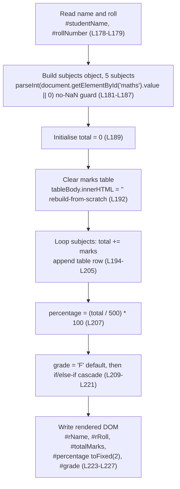
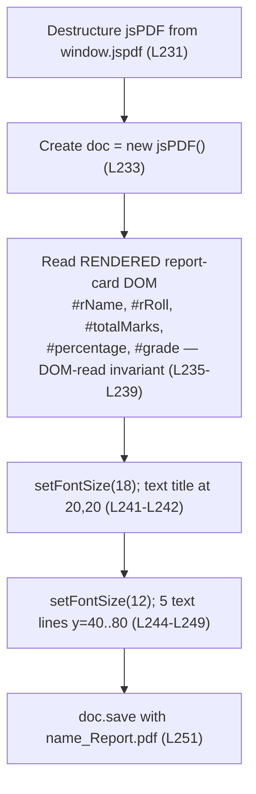

# Script Reference — script.js

## Purpose

The application's behavioral logic lives in a single embedded `script.js` block that exposes **exactly two public, global functions**, each wired to a button through an inline `onclick` handler [Readme.md:L70-L71]:

- **`generateReport()`** — reads the **form inputs**, computes the total, percentage, and grade, and renders the on-screen report card [Readme.md:L177-L228].
- **`downloadPDF()`** — reads the already-**rendered** report card from the DOM and exports it as a PDF file [Readme.md:L230-L252].

Both functions are **parameterless** and **side-effecting**: they take no arguments, implicitly return `undefined`, and operate entirely by reading from and writing to the DOM. Neither performs persistence or asynchronous work of its own; the only external code is the jsPDF library, loaded once from a CDN [Readme.md:L53].

All content on this page is **code-grounded**: every technical claim carries an inline `[Readme.md:Lx-Ly]` citation pointing at the source embedded in the repository-root `Readme.md`. The standalone `script.js` implied by the README's project tree does not physically exist, so `Readme.md` is the sole source. This is a documentation-only reference and does not modify any source code.

## Source Location

The behavioral logic is the embedded `script.js` block in the repository-root `Readme.md`:

- **Full `script.js` block:** [Readme.md:L176-L253]
- **`generateReport()`:** [Readme.md:L177-L228]
- **`downloadPDF()`:** [Readme.md:L230-L252]

---

## Function: `generateReport()`

The compute-and-render entry point. It reads the seven **form inputs**, builds a fixed five-subject marks object, computes the total / percentage / grade, and writes the results into the **rendered DOM** report card.

| Property | Value |
| --- | --- |
| **Signature** | `generateReport()` [Readme.md:L177] |
| **Parameters** | None — the function reads the DOM by element ID. |
| **Returns** | `undefined` — there is no `return` statement; the function is invoked purely for its side-effecting DOM writes [Readme.md:L177-L228]. |
| **Invoked by** | The **Generate Report** button via inline `onclick="generateReport()"` [Readme.md:L70]. |

### Reads (form inputs)

The function reads two identity fields and five subject-mark fields by element ID:

| Element ID | Purpose | Read via | Source |
| --- | --- | --- | --- |
| `#studentName` | Student name (string) | `.value` | [Readme.md:L178] |
| `#rollNumber` | Roll number (string) | `.value` | [Readme.md:L179] |
| `#maths` | Maths marks (integer) | `parseInt` + no-NaN guard | [Readme.md:L182] |
| `#science` | Science marks (integer) | `parseInt` + no-NaN guard | [Readme.md:L183] |
| `#english` | English marks (integer) | `parseInt` + no-NaN guard | [Readme.md:L184] |
| `#history` | History marks (integer) | `parseInt` + no-NaN guard | [Readme.md:L185] |
| `#computer` | Computer marks (integer) | `parseInt` + no-NaN guard | [Readme.md:L186] |

The five subject reads are collected into a `subjects` object in the fixed source order Maths → Science → English → History → Computer [Readme.md:L181-L187].

### Writes (rendered DOM)

| Element ID | Written value | Source |
| --- | --- | --- |
| `#marksTable` | Cleared, then one `<tr>` row appended per subject | [Readme.md:L191-L192], [Readme.md:L204] |
| `#rName` | Student name, via `.innerText` | [Readme.md:L223] |
| `#rRoll` | Roll number, via `.innerText` | [Readme.md:L224] |
| `#totalMarks` | Total marks, **unformatted**, via `.innerText` | [Readme.md:L225] |
| `#percentage` | Percentage as a 2-decimal **string** via `.toFixed(2)` | [Readme.md:L226] |
| `#grade` | Assigned grade letter, via `.innerText` | [Readme.md:L227] |

### Behavior / side effects

The behavior rests on the application's documented invariants. The full definitions are the single source of truth in [`../contracts/behavioral-contracts.md`](../contracts/behavioral-contracts.md); they are summarized here (not duplicated) with citations:

- **No-NaN guard.** Each subject is coerced with `parseInt(document.getElementById('<id>').value || 0)`, so a blank or otherwise falsy field defaults to `0` rather than `NaN` [Readme.md:L182-L186]. The guard does **not** clamp negative values or values above the (unenforced) per-subject maximum of `100`; there is no range validation anywhere — see [`../reference/data-schema.md`](../reference/data-schema.md).
- **Rebuild-from-scratch rendering.** The marks-table body is cleared (`tableBody.innerHTML = ''`) before the per-subject loop re-appends rows, so every run yields exactly five fresh rows with no stale accumulation [Readme.md:L191-L192].
- **Percentage formula.** The percentage is computed against a fixed 500-point denominator: `percentage = (total / 500) * 100` [Readme.md:L207]. The denominator and the subject schema are owned by [`../reference/data-schema.md`](../reference/data-schema.md).
- **Fixed 2-decimal display.** Only the **displayed** `#percentage` is a 2-decimal string produced by `.toFixed(2)` [Readme.md:L226]; the internal `percentage` value keeps full numeric precision [Readme.md:L207], and `#totalMarks` is written unformatted [Readme.md:L225]. The stored number is **not** rounded.
- **Default grade `'F'`.** `grade` is initialized to `'F'` [Readme.md:L209] and reassigned by an ordered `if/else-if` cascade; `'F'` is retained when every threshold test fails (percentage below 50) [Readme.md:L211-L221]. The canonical thresholds live in [`../reference/data-schema.md`](../reference/data-schema.md).

Short verbatim excerpt — the no-NaN guard [Readme.md:L182] and the percentage formula [Readme.md:L207]:

```javascript
Maths: parseInt(document.getElementById('maths').value || 0),
const percentage = (total / 500) * 100;
```

### Worked example (illustrative)

Marks `90 / 85 / 80 / 75 / 70` → total `400` → percentage `80.00` → grade `'A'` (because `400 / 500 * 100 = 80`, which satisfies the `>= 80` branch) [Readme.md:L207], [Readme.md:L211-L221]. This example is illustrative only; for the full computation and grading walkthroughs see [`../functionality/computation.md`](../functionality/computation.md) and [`../functionality/grading.md`](../functionality/grading.md).

---

## Function: `downloadPDF()`

The PDF-export entry point. It reads the **rendered** report-card DOM (not the form inputs), lays the values onto a new jsPDF document, and triggers a browser download.

| Property | Value |
| --- | --- |
| **Signature** | `downloadPDF()` [Readme.md:L230] |
| **Parameters** | None — the function reads the rendered DOM by element ID. |
| **Returns** | `undefined` — there is no `return` statement; the function is invoked for its side effect of saving a file [Readme.md:L230-L252]. |
| **Invoked by** | The **Download PDF** button via inline `onclick="downloadPDF()"` [Readme.md:L71]. |

### Depends on

The function destructures the `jsPDF` constructor from the `window.jspdf` global and instantiates a document [Readme.md:L231], [Readme.md:L233]:

```javascript
const { jsPDF } = window.jspdf;   // L231 — throws TypeError if undefined
const doc = new jsPDF();          // L233
```

`window.jspdf` is the global namespace published by the jsPDF 2.5.1 UMD build, loaded from the cdnjs CDN [Readme.md:L53]. Note the casing: the global namespace is `window.jspdf` (all lowercase) while the constructor is `jsPDF` (capital `P`, capital `DF`) [Readme.md:L231]. The CDN-availability contract is documented in [`../dependencies.md`](../dependencies.md).

### Reads (rendered report-card DOM — the DOM-read invariant)

`downloadPDF()` reads the **rendered output**, **not** the form inputs. This is the **DOM-read invariant**, the single most architecturally significant expectation in the application:

| Element ID | Read via | Source |
| --- | --- | --- |
| `#rName` | `.innerText` | [Readme.md:L235] |
| `#rRoll` | `.innerText` | [Readme.md:L236] |
| `#totalMarks` | `.innerText` | [Readme.md:L237] |
| `#percentage` | `.innerText` | [Readme.md:L238] |
| `#grade` | `.innerText` | [Readme.md:L239] |

Because these are precisely the values that `generateReport()` writes, **`generateReport()` must run before `downloadPDF()`** — the export mirrors whatever the rendered report card currently shows. The full invariant is defined in [`../contracts/behavioral-contracts.md`](../contracts/behavioral-contracts.md); the feature guide is [`../functionality/pdf-export.md`](../functionality/pdf-export.md).

### Writes (PDF document)

| Step | Call | Source |
| --- | --- | --- |
| Title font | `doc.setFontSize(18)` | [Readme.md:L241] |
| Title text | `doc.text('Student Report Card', 20, 20)` | [Readme.md:L242] |
| Body font | `doc.setFontSize(12)` | [Readme.md:L244] |
| Body lines | Five `doc.text(...)` lines at `x = 20`, `y = 40 / 50 / 60 / 70 / 80` | [Readme.md:L245-L249] |
| Save | `doc.save(...)` — file named `<name>_Report.pdf` | [Readme.md:L251] |

The saved file is named `<name>_Report.pdf`, where `name` is the value read from the rendered `#rName` element [Readme.md:L235], [Readme.md:L251].

### Error handling

There is **no programmatic error handling** in the function — no `try/catch` block and no validation anywhere in `downloadPDF()` [Readme.md:L230-L252]. Two failure modes follow from this and are documented as **expected behavior**, not bugs to fix here:

- **`TypeError` when `window.jspdf` is `undefined`.** If the jsPDF CDN script is unreachable, blocked, offline, or has not yet loaded, the destructuring line `const { jsPDF } = window.jspdf;` throws a `TypeError` ("cannot destructure property `jsPDF` of `undefined`") [Readme.md:L231]. The failure surfaces only in the browser console.
- **Silent blank PDF when "Download" precedes "Generate".** Clicking Download PDF before Generate Report throws **no** error, but because the rendered DOM was never populated, the saved PDF contains blank / default field values [Readme.md:L235-L239].

Short verbatim excerpt — the dependency destructure [Readme.md:L231] and the save [Readme.md:L251]:

```javascript
const { jsPDF } = window.jspdf;
doc.save(`${name}_Report.pdf`);
```

---

## Diagrams

Both flowcharts below are validated against the cited source ranges and mirror the authoritative diagrams in [`../architecture/data-flow.md`](../architecture/data-flow.md) for consistency.

### `generateReport()` Flow



*Validated against [Readme.md:L177-L228].*

### `downloadPDF()` Flow



*Validated against [Readme.md:L230-L252].*

---

## Expected Behavior / Contract

This section is the page's direct answer to *"highlight what is the expectation from the code."* It states a **concise per-function contract**. The full, authoritative catalog of invariants, preconditions, and postconditions is the single source of truth in [`../contracts/behavioral-contracts.md`](../contracts/behavioral-contracts.md) and is **not duplicated** here.

### `generateReport()` contract

| Aspect | Expectation |
| --- | --- |
| **Preconditions** | The 13 expected element IDs exist in the DOM — the 7 form inputs plus the 6 report-card placeholders (see [`html-structure.md`](html-structure.md)). |
| **Inputs** | 7 form fields: `#studentName`, `#rollNumber`, and the five subject inputs `#maths` / `#science` / `#english` / `#history` / `#computer` [Readme.md:L178-L186]. |
| **Outputs / postconditions** | The report card is populated — `#rName`, `#rRoll`, `#totalMarks`, `#percentage`, `#grade` are written [Readme.md:L223-L227] — and `#marksTable` is rebuilt to exactly five rows [Readme.md:L194-L205]. |
| **Side effects** | DOM writes only; no network, persistence, or asynchronous work [Readme.md:L177-L228]. |
| **Determinism** | Identical form inputs always produce identical output — no randomness, time, or persistence [Readme.md:L177-L228]. |
| **Error modes** | A missing expected element ID causes a `TypeError` on the null `.value` / `.innerText` access; there is no validation beyond the no-NaN guard [Readme.md:L182-L186]. |

### `downloadPDF()` contract

| Aspect | Expectation |
| --- | --- |
| **Preconditions** | (1) `generateReport()` ran first, so the rendered report-card DOM is populated — the DOM-read invariant [Readme.md:L235-L239]; (2) `window.jspdf` is defined, i.e. the CDN script loaded [Readme.md:L53], [Readme.md:L231]. |
| **Inputs** | The five rendered report-card values `#rName` / `#rRoll` / `#totalMarks` / `#percentage` / `#grade` [Readme.md:L235-L239]. |
| **Outputs / postconditions** | A PDF named `<name>_Report.pdf` is downloaded [Readme.md:L251], populated from the rendered DOM values [Readme.md:L235-L249]. |
| **Side effects** | Triggers a browser file download; performs no DOM writes [Readme.md:L241-L251]. |
| **Determinism** | Given the same rendered DOM and an available jsPDF, the same PDF content and filename are produced [Readme.md:L235-L251]. |
| **Error modes** | `TypeError` if `window.jspdf` is `undefined` [Readme.md:L231]; a silent blank PDF (no error) if Generate Report was not run first [Readme.md:L235-L239]. No `try/catch` anywhere [Readme.md:L230-L252]. |

For the complete invariant / precondition / postcondition catalog — including the determinism guarantee and the no-input-validation discussion — see the single source of truth: [`../contracts/behavioral-contracts.md`](../contracts/behavioral-contracts.md).

---

## Related Documents

This page is part of a hub-and-spoke documentation set. Related references (paths relative to `docs/api-reference/`):

- [`html-structure.md`](html-structure.md) — the DOM element / ID reference for every input and report-card placeholder these functions read and write.
- [`../architecture/data-flow.md`](../architecture/data-flow.md) — the end-to-end, DOM-mediated data flow and the authoritative function flowcharts.
- [`../contracts/behavioral-contracts.md`](../contracts/behavioral-contracts.md) — the single source of truth for invariants, preconditions, postconditions, and error modes.
- [`../reference/data-schema.md`](../reference/data-schema.md) — the fixed subjects, the 500-point denominator, and the grade thresholds.
- [`../functionality/pdf-export.md`](../functionality/pdf-export.md) — the F-007 PDF export feature guide.
- [`../dependencies.md`](../dependencies.md) — the jsPDF 2.5.1 CDN integration and the CDN-availability precondition.
- [`../index.md`](../index.md) — back to the Documentation Hub.

---

*Maintenance note: this reference is derived from the application source embedded in `Readme.md` [Readme.md:L176-L253]. If that embedded `script.js` block changes, update the cited line ranges and the function descriptions here so this reference stays accurate.*
