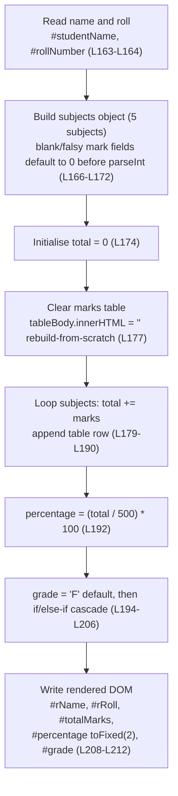
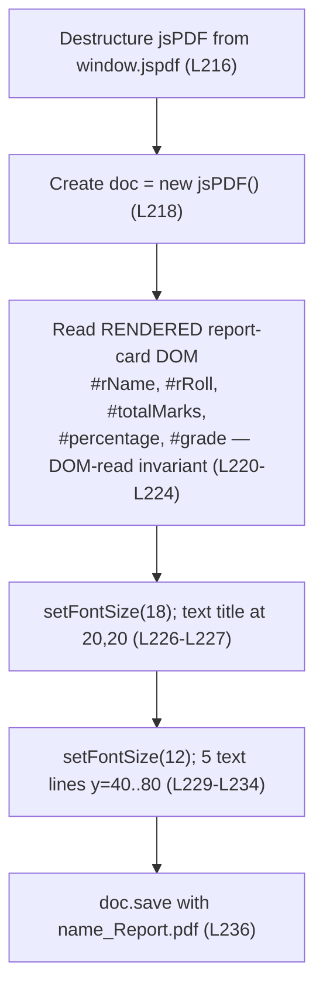

# Script Reference — script.js

## Purpose

This page is the **API reference** for the Student Report Generator's behavioral logic. It
documents the **two public, global JavaScript functions** that make up the entire `script.js`
module: `generateReport()` and `downloadPDF()`. Both are wired to the page's action buttons via
inline `onclick` attributes [Readme.md:L55-L56]:

- **`generateReport()`** — reads the **form inputs**, computes the total, percentage, and grade,
  and renders the on-screen report card [Readme.md:L162-L213].
- **`downloadPDF()`** — reads the **rendered DOM** report card and exports it as a PDF file
  [Readme.md:L215-L237].

Both functions are **parameterless** and **side-effecting**: they take no arguments, return
`undefined`, and act purely by reading from and writing to the DOM (and, for `downloadPDF()`,
the jsPDF library). This page gives each function's exact signature, the elements it reads and
writes, its side effects, its error behavior, a flow diagram, and an explicit
**Expected Behavior / Contract**.

All content is **code-grounded**: every technical claim carries an inline `Readme.md` line-range
citation back to the application source, which is embedded in the repository-root `Readme.md`.
Code excerpts are short, verbatim quotations of the cited lines. The standalone `script.js`
implied by the README's project tree does not physically exist as a separate file; `Readme.md`
is the sole source.

> **Single source of truth (SSOT).** This page documents *signatures and behavior*. It does
> **not** re-assert the canonical fixed values or the full invariant catalog. For the fixed
> subjects, the `500`-point denominator, and the grade thresholds, see
> [`../reference/data-schema.md`](../reference/data-schema.md); for the complete set of
> invariants, preconditions, and postconditions, see
> [`../contracts/behavioral-contracts.md`](../contracts/behavioral-contracts.md).

## Source Location

`Source: [Readme.md:L161-L238]` — the embedded `script.js` fenced code block.

- `generateReport()` — [Readme.md:L162-L213]
- `downloadPDF()` — [Readme.md:L215-L237]
- jsPDF CDN `<script>` (the dependency `downloadPDF()` relies on) — [Readme.md:L38]

---

## How It Works

The module exposes **two parameterless, side-effecting global functions**, each wired to a page action button by an inline `onclick` attribute [Readme.md:L55-L56]:

1. **`generateReport()`** runs on **Generate Report**. It reads the seven **form inputs** by element ID [Readme.md:L163-L172], builds a five-subject object using the `parseInt(... .value || 0)` no-NaN guard [Readme.md:L166-L172], rebuilds the marks table from scratch, computes `total`, `percentage = (total / 500) * 100`, and a letter `grade`, then writes the results into the **rendered report-card DOM** [Readme.md:L174-L212].
2. **`downloadPDF()`** runs on **Download PDF**. It destructures the `jsPDF` constructor from the `window.jspdf` global [Readme.md:L216], reads the already-**rendered** report-card values — the **DOM-read invariant**, not the form inputs [Readme.md:L220-L224] — lays them out, and saves a file named `` `${name}_Report.pdf` `` [Readme.md:L236].

Both functions take no arguments and return `undefined`; all of their work is performed through DOM reads/writes (and, for `downloadPDF()`, the jsPDF library). Each function's exact signature, the elements it reads and writes, its side effects, its error behavior, and a flow diagram are detailed below.

---

## Function: generateReport()

Computes the report from the **form inputs** and renders the on-screen report card. This is the
function behind the **Generate Report** button [Readme.md:L55].

### Signature

Declared at [Readme.md:L162]:

```javascript
function generateReport() {
```

| Aspect | Value | Source |
|---|---|---|
| **Parameters** | none — reads the DOM by element ID | [Readme.md:L162-L213] |
| **Returns** | `undefined` — no `return` statement; the function is purely side-effecting | [Readme.md:L162-L213] |
| **Invocation** | inline `onclick="generateReport()"` on the Generate Report button | [Readme.md:L55] |

### Reads (form inputs)

`generateReport()` reads seven `<input>` fields by element ID — two identity fields and five
subject-mark fields.

| Element ID | Read as | Source |
|---|---|---|
| `#studentName` | `.value` (string) | [Readme.md:L163] |
| `#rollNumber` | `.value` (string) | [Readme.md:L164] |
| `#maths` | `parseInt(.value \|\| 0)` (number) | [Readme.md:L167] |
| `#science` | `parseInt(.value \|\| 0)` (number) | [Readme.md:L168] |
| `#english` | `parseInt(.value \|\| 0)` (number) | [Readme.md:L169] |
| `#history` | `parseInt(.value \|\| 0)` (number) | [Readme.md:L170] |
| `#computer` | `parseInt(.value \|\| 0)` (number) | [Readme.md:L171] |

The five subjects, their input IDs, and the fact that the per-subject maximum of `100` is **not
enforced** are owned by [`../reference/data-schema.md`](../reference/data-schema.md). For the DOM
element/ID reference, see [`html-structure.md`](html-structure.md).

### Writes (rendered DOM)

`generateReport()` writes six elements of the report card — the marks table plus five
report-card fields.

| Element ID | Written value | Source |
|---|---|---|
| `#marksTable` | cleared (`innerHTML = ''`), then one `<tr>` row appended per subject | [Readme.md:L176-L177], [Readme.md:L189] |
| `#rName` | student name (`.innerText`) | [Readme.md:L208] |
| `#rRoll` | roll number (`.innerText`) | [Readme.md:L209] |
| `#totalMarks` | total marks, **unformatted** (`.innerText`) | [Readme.md:L210] |
| `#percentage` | percentage as a 2-decimal **string** via `.toFixed(2)` | [Readme.md:L211] |
| `#grade` | letter grade (`.innerText`) | [Readme.md:L212] |

### Behavior / side effects

The function's behavior depends on five documented properties. Each is defined in full (as an
invariant) in [`../contracts/behavioral-contracts.md`](../contracts/behavioral-contracts.md);
this page summarizes them and links rather than duplicating the catalog.

- **Rebuild-from-scratch render** — the marks table body is cleared before the per-subject loop
  repopulates it, so each run yields a fresh table of exactly five rows and repeated runs never
  accumulate stale rows [Readme.md:L176-L177].
- **No-NaN guard** — each subject is read with `parseInt(... .value || 0)`; the `|| 0` defaults a
  blank/falsy `.value` to `0` *before* `parseInt` runs, so an empty field contributes `0` rather
  than `NaN` [Readme.md:L167-L171]. The guard defaults only blank/falsy values; it does **not**
  validate arbitrary non-empty input and does **not** clamp negatives or values above `100` —
  there is **no range validation anywhere** (the unenforced per-subject maximum is documented in
  [`../reference/data-schema.md`](../reference/data-schema.md)).
- **Percentage formula** — `percentage = (total / 500) * 100`, using the fixed `500`-point
  denominator [Readme.md:L192].
- **Fixed 2-decimal display** — only the *displayed* `#percentage` is rounded to two decimals via
  `.toFixed(2)` [Readme.md:L211]; the internal `percentage` remains a full-precision JavaScript
  number [Readme.md:L192], and `#totalMarks` is written **unformatted** [Readme.md:L210].
- **Default grade `'F'`** — `grade` is initialized to `'F'` [Readme.md:L194] and reassigned by an
  ordered `if / else-if` cascade [Readme.md:L196-L206]; the `'F'` default is retained whenever
  every threshold test fails (percentage `< 50`).

Representative excerpts, quoted verbatim from the source. The no-NaN guard on the first subject
[Readme.md:L167]:

```javascript
Maths: parseInt(document.getElementById('maths').value || 0),
```

The percentage formula [Readme.md:L192]:

```javascript
const percentage = (total / 500) * 100;
```

### Worked example (illustrative)

Marks `90 / 85 / 80 / 75 / 70` → `total = 400` → `percentage = (400 / 500) * 100 = 80.00` →
since `80 >= 80` (and the `>= 90` test fails first), `grade = 'A'` [Readme.md:L192-L206]. For the
full end-to-end example flow, see [`../functionality/computation.md`](../functionality/computation.md)
and [`../functionality/grading.md`](../functionality/grading.md).

---

## Function: downloadPDF()

Exports the **rendered** report card as a PDF file using the jsPDF library. This is the function
behind the **Download PDF** button [Readme.md:L56].

### Signature

Declared at [Readme.md:L215]:

```javascript
function downloadPDF() {
```

| Aspect | Value | Source |
|---|---|---|
| **Parameters** | none — reads the rendered DOM by element ID | [Readme.md:L215-L237] |
| **Returns** | `undefined` — no `return` statement; triggers a browser file save as its side effect | [Readme.md:L215-L237] |
| **Invocation** | inline `onclick="downloadPDF()"` on the Download PDF button | [Readme.md:L56] |

### Depends on

`downloadPDF()` destructures the `jsPDF` constructor from the global `window.jspdf` namespace and
instantiates a document [Readme.md:L216-L218]:

```javascript
const { jsPDF } = window.jspdf;

const doc = new jsPDF();
```

The destructuring line throws a `TypeError` if `window.jspdf` is `undefined` (see
[Error handling](#error-handling) below).

The lowercase `window.jspdf` global is populated by the jsPDF **2.5.1** UMD bundle loaded from the
cdnjs `<script>` tag in the page `<head>` [Readme.md:L38]. The full CDN-availability contract is
documented in [`../dependencies.md`](../dependencies.md).

### Reads (rendered report-card DOM — the DOM-read invariant)

`downloadPDF()` reads its five values from the **rendered DOM** report card via `.innerText` —
**not** from the **form inputs**. This is the **DOM-read invariant**, the single most
architecturally significant expectation of the application.

| Element ID | Read as | Source |
|---|---|---|
| `#rName` | `.innerText` (rendered name) | [Readme.md:L220] |
| `#rRoll` | `.innerText` (rendered roll number) | [Readme.md:L221] |
| `#totalMarks` | `.innerText` (rendered total) | [Readme.md:L222] |
| `#percentage` | `.innerText` (rendered percentage string) | [Readme.md:L223] |
| `#grade` | `.innerText` (rendered grade) | [Readme.md:L224] |

Because these are the elements that `generateReport()` *writes* [Readme.md:L208-L212],
`generateReport()` **must run before** `downloadPDF()` — otherwise the rendered fields are empty
and the PDF contains blank values (see [Error handling](#error-handling) below). The complete
DOM-read invariant is defined in
[`../contracts/behavioral-contracts.md`](../contracts/behavioral-contracts.md).

### Writes (PDF document)

`downloadPDF()` builds a one-page PDF using three jsPDF methods, then saves it.

| Step | Operation | Source |
|---|---|---|
| Title | `setFontSize(18)`, then `text('Student Report Card', 20, 20)` | [Readme.md:L226-L227] |
| Body | `setFontSize(12)`, then five `text(...)` lines at `x = 20`, `y = 40 / 50 / 60 / 70 / 80` (name, roll, total, percentage, grade) | [Readme.md:L229-L234] |
| Save | ``doc.save(`${name}_Report.pdf`)`` — downloads the file | [Readme.md:L236] |

The saved filename follows the pattern `<name>_Report.pdf`, where `name` is the value read from
the rendered `#rName` element [Readme.md:L220], [Readme.md:L236] — for example, a rendered name of
`Asha` produces `Asha_Report.pdf`. The exact PDF layout (positions and font sizes) is also
documented in the feature guide [`../functionality/pdf-export.md`](../functionality/pdf-export.md).

### Error handling

The function performs **no programmatic error handling** — there is **no** `try/catch` and **no**
validation anywhere in `downloadPDF()` [Readme.md:L215-L237]. Two failure behaviors follow
directly and are the *expected* (unguarded) outcomes, not bugs to be patched here:

- **Missing jsPDF → `TypeError`.** If `window.jspdf` is `undefined` (the CDN is unreachable,
  blocked, or offline, or the function somehow runs before the CDN script has loaded), the
  destructuring line `const { jsPDF } = window.jspdf;` [Readme.md:L216] throws a `TypeError`
  ("cannot destructure property 'jsPDF' of 'undefined'"). With no surrounding `try/catch`, the
  error surfaces only in the browser's developer console.
- **Download before Generate → silent blank PDF (no error thrown).** If **Download PDF** is
  clicked before **Generate Report**, no exception is raised: the DOM-read invariant
  [Readme.md:L220-L224] reads empty strings from the never-populated report card, and the
  resulting PDF simply contains blank/default field values.

Representative excerpts, quoted verbatim from the source. The dependency destructure
[Readme.md:L216]:

```javascript
const { jsPDF } = window.jspdf;
```

The file save [Readme.md:L236]:

```javascript
doc.save(`${name}_Report.pdf`);
```

---

## Diagrams

These flowcharts mirror the authoritative diagrams in
[`../architecture/data-flow.md`](../architecture/data-flow.md) for consistency.

### generateReport() Flow



*Validated against the source `generateReport()` definition [Readme.md:L162-L213].*

### downloadPDF() Flow



*Validated against the source `downloadPDF()` definition [Readme.md:L215-L237].*

---

## Expected Behavior / Contract

This section is the direct answer to *"what is the expectation from the code?"* for the two
functions. It states a concise per-function contract; the full, authoritative invariant and
precondition catalog lives in
[`../contracts/behavioral-contracts.md`](../contracts/behavioral-contracts.md).

### generateReport() — contract

| Aspect | Expectation | Source |
|---|---|---|
| **Preconditions** | The 13 expected element IDs exist in the DOM — the 7 form inputs it reads plus the 6 report-card elements it writes. No other precondition. | [Readme.md:L163-L171], [Readme.md:L176-L212] |
| **Inputs** | 7 form fields: `#studentName`, `#rollNumber`, and the five subject marks `#maths` / `#science` / `#english` / `#history` / `#computer`. | [Readme.md:L163-L171] |
| **Outputs / postconditions** | The report card is fully populated (`#rName`, `#rRoll`, `#totalMarks`, `#percentage`, `#grade`) and `#marksTable` is rebuilt to **exactly 5 rows**. | [Readme.md:L179-L212] |
| **Side effects** | DOM writes only — no network, no persistence, no storage. | [Readme.md:L176-L212] |
| **Determinism** | Identical **form inputs** always produce identical output — no randomness, no time/`Date` dependency, no persistence. | [Readme.md:L162-L213] |
| **Error modes** | Missing element IDs → `TypeError` on a `null` read. There is **no input validation** beyond the `\|\| 0` no-NaN guard; out-of-range or negative marks are accepted. | [Readme.md:L163-L171], [Readme.md:L176-L212] |

### downloadPDF() — contract

| Aspect | Expectation | Source |
|---|---|---|
| **Preconditions** | (1) `generateReport()` has already run, so the rendered report card is populated (the **DOM-read invariant**); (2) `window.jspdf` is defined by the loaded CDN script. | [Readme.md:L220-L224], [Readme.md:L38], [Readme.md:L216] |
| **Inputs** | 5 **rendered** report-card fields read by `.innerText`: `#rName`, `#rRoll`, `#totalMarks`, `#percentage`, `#grade`. | [Readme.md:L220-L224] |
| **Outputs / postconditions** | A one-page PDF named `<name>_Report.pdf` is generated and downloaded by the browser. | [Readme.md:L236] |
| **Side effects** | Reads the rendered DOM and triggers a browser file save; no network beyond the already-loaded library, no persistence. | [Readme.md:L220-L236] |
| **Determinism** | Deterministic given the rendered report-card state; the output reflects whatever `generateReport()` last wrote. | [Readme.md:L220-L236] |
| **Error modes** | `TypeError` if `window.jspdf` is `undefined`; a **silent blank PDF** (no error) if **Download** is clicked before **Generate**. No `try/catch`. | [Readme.md:L216], [Readme.md:L220-L224] |

> For the complete catalog of invariants, preconditions, postconditions, error modes, and the
> determinism guarantee, see
> [`../contracts/behavioral-contracts.md`](../contracts/behavioral-contracts.md) — the **single
> source of truth** for the application's behavioral contracts. This page intentionally does not
> duplicate it in full.

---

## Related Documents

- [`html-structure.md`](html-structure.md) — the DOM element/ID reference for the elements these
  functions read and write.
- [`../architecture/data-flow.md`](../architecture/data-flow.md) — the end-to-end data flow and the
  authoritative function flowcharts.
- [`../contracts/behavioral-contracts.md`](../contracts/behavioral-contracts.md) — the full
  invariant, precondition, and postcondition catalog (SSOT).
- [`../reference/data-schema.md`](../reference/data-schema.md) — the fixed subjects, the `500`
  denominator, and the grade thresholds (SSOT).
- [`../functionality/pdf-export.md`](../functionality/pdf-export.md) — the F-007 PDF-export feature
  guide.
- [`../dependencies.md`](../dependencies.md) — the jsPDF 2.5.1 CDN integration and availability
  precondition.
- [`../index.md`](../index.md) — back to the Documentation Hub.
