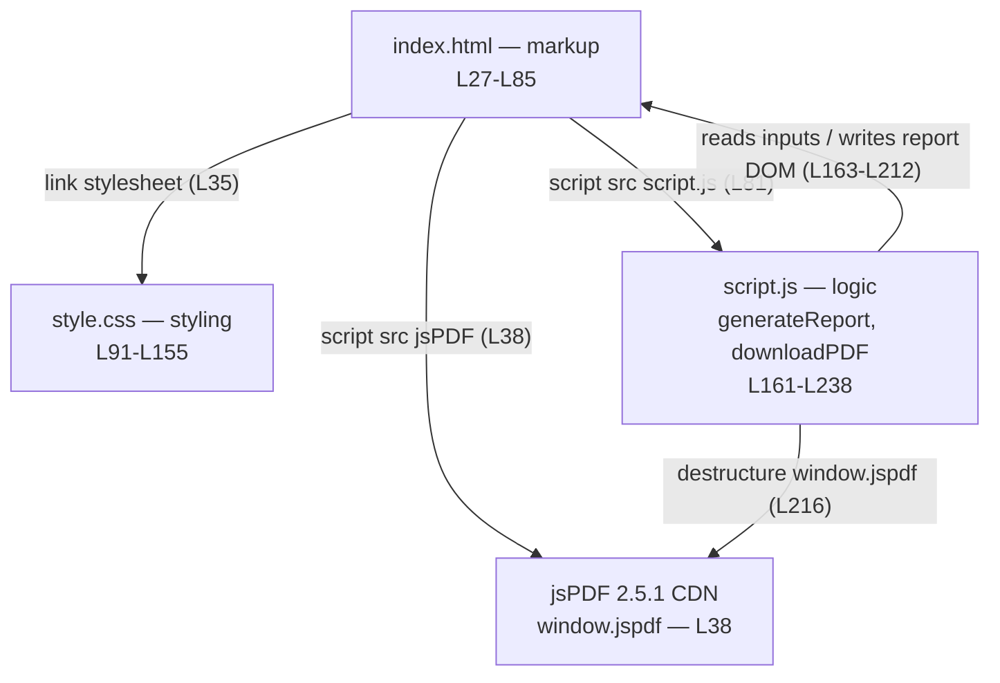

# Component Model

## Purpose

This page identifies the **logical components** of the Student Report Generator, their individual responsibilities, and how they relate to one another at runtime. The application is built from three logical components — presentation markup, presentation styling, and behavioral logic — together with a single **external dependency**, the jsPDF library loaded from a CDN [Readme.md:L27-L238]. All content on this page is **code-grounded**: every technical claim carries an inline `[Readme.md:Lx-Ly]` citation pointing at the application source embedded in the repository-root `Readme.md`. This is a documentation-only reference and does not modify any source code.

**Source:** `[Readme.md:L27-L238]`

---

## Components & Responsibilities

The application separates cleanly into four units of responsibility: the markup that defines the page structure, the stylesheet that styles it, the script that drives all behavior, and the one third-party library that produces the PDF. Each row below names a logical component, its runtime role, its source location in `Readme.md`, and the key surface it exposes or owns. The detailed element, selector, and function references live in dedicated companion documents and are linked rather than duplicated here.

| Component | Role | Source | Key Surface / Responsibilities |
|---|---|---|---|
| Presentation markup — `index.html` | Defines page structure and the DOM that the logic reads from and writes to | `[Readme.md:L27-L85]` | Form inputs `[Readme.md:L46-L53]`, action buttons `[Readme.md:L55-L56]`, report-card placeholders `[Readme.md:L59-L78]` |
| Presentation styling — `style.css` | Static visual styling (feature F-008) of the page and rendered report | `[Readme.md:L91-L155]` | Layout (`.container`, `.form-section`), color palette, table styling |
| Behavioral logic — `script.js` | Reads inputs, computes results, renders the report card, and exports the PDF | `[Readme.md:L161-L238]` | `generateReport()` `[Readme.md:L162-L213]`, `downloadPDF()` `[Readme.md:L215-L237]` |
| External dependency — jsPDF 2.5.1 (cdnjs) | Generates the downloadable PDF document | `[Readme.md:L38]` | `window.jspdf` global → `jsPDF` constructor `[Readme.md:L216]` |

### Presentation markup — `index.html`

The markup is the structural backbone of the application. It defines the **form inputs** that capture data — `#studentName`, `#rollNumber`, `#maths`, `#science`, `#english`, `#history`, and `#computer` `[Readme.md:L46-L53]` — and the two action buttons wired to the behavioral logic through inline `onclick` handlers: **Generate Report** calls `generateReport()` and **Download PDF** calls `downloadPDF()` `[Readme.md:L55-L56]`. It also declares the report-card placeholders — `#rName`, `#rRoll`, `#marksTable`, `#totalMarks`, `#percentage`, and `#grade` — that the logic populates after a report is generated `[Readme.md:L59-L78]`. For the full element / ID reference and the function-wiring table, see [`../api-reference/html-structure.md`](../api-reference/html-structure.md).

### Presentation styling — `style.css`

The stylesheet is purely presentational and entirely static. It centers the application inside a fixed-width `.container` card and lays the form out with the `.form-section` grid, establishes the color palette — the primary action button color `#007bff` with a `#0056b3` hover state, on a light-grey `#f4f6f8` page background — and styles the marks table with `border-collapse` and a 1px border on the table and every `th`/`td` cell `[Readme.md:L91-L155]`. For the complete selector / style reference, see [`../api-reference/css-reference.md`](../api-reference/css-reference.md).

### Behavioral logic — `script.js`

The behavioral logic exposes two parameterless, side-effecting global functions. `generateReport()` reads the **form inputs**, computes the total, percentage, and grade, and writes the results into the report-card DOM `[Readme.md:L162-L213]`. `downloadPDF()` then reads the already-**rendered DOM** report card — not the original form inputs — and exports it as a PDF via jsPDF `[Readme.md:L215-L237]`. For the exact signatures, parameters, reads/writes, and contracts, see [`../api-reference/script-js.md`](../api-reference/script-js.md).

### External integration — jsPDF 2.5.1 (cdnjs)

jsPDF is the application's sole **external dependency**. It is loaded as a UMD script into the document `<head>` directly from the cdnjs (Cloudflare) CDN, pinned to version 2.5.1 `[Readme.md:L38]`. The UMD build publishes the library onto the browser global as `window.jspdf`, from which `downloadPDF()` destructures the `jsPDF` constructor before building and saving the document `[Readme.md:L216]`. For the integration contract and the CDN-availability precondition, see [`../dependencies.md`](../dependencies.md).

---

### Note: Logical vs. Physical Components

The project tree in the repository root advertises `index.html`, `style.css`, and `script.js` as three standalone files `[Readme.md:L14-L21]`. In practice, however, they currently exist only **embedded inside `Readme.md`**, each contained within a fenced code block. This documentation therefore treats them as **logical components** rather than physical files. Physically extracting the embedded code into separate standalone files would be a source-code change and is **out of scope** for this documentation-only effort (AAP 0.8.2). The terminology "logical component" is used consistently throughout these docs to reflect that distinction.

---

## Component-Relationship Diagram

The diagram below shows the runtime relationships between the four components: the markup loads the stylesheet, the jsPDF library, and the logic script, while the logic reads from and writes to the markup's DOM and calls into jsPDF to produce the PDF.



*Diagram validated against `[Readme.md:L35]`, `[Readme.md:L38]`, `[Readme.md:L81]`, `[Readme.md:L163-L212]`, `[Readme.md:L216]`.*

The three load directives that establish the markup's outgoing relationships are quoted verbatim from the `<head>` and end-of-`<body>` of the markup `[Readme.md:L35]`, `[Readme.md:L38]`, `[Readme.md:L81]`:

```html
<link rel="stylesheet" href="style.css">
<script src="https://cdnjs.cloudflare.com/ajax/libs/jspdf/2.5.1/jspdf.umd.min.js"></script>
<script src="script.js"></script>
```

---

## Related Documents

- [`../api-reference/script-js.md`](../api-reference/script-js.md) — `generateReport()` and `downloadPDF()` signatures and contracts.
- [`../api-reference/html-structure.md`](../api-reference/html-structure.md) — DOM element / ID reference.
- [`../api-reference/css-reference.md`](../api-reference/css-reference.md) — selector / style reference.
- [`../dependencies.md`](../dependencies.md) — jsPDF integration contract and CDN-availability precondition.
- [`../reference/data-schema.md`](../reference/data-schema.md) — **single source of truth** for fixed values (the five subjects, the per-subject maximum, the `500`-point denominator, and the grade thresholds); this page describes component topology, while those values remain authoritative there.
- [`../contracts/behavioral-contracts.md`](../contracts/behavioral-contracts.md) — **single source of truth** for invariants, preconditions, and postconditions; the components' behavioral expectations are defined there rather than restated here.
- [`overview.md`](overview.md) — system context and high-level architecture.
- [`data-flow.md`](data-flow.md) — runtime data flow across the components.
- [`../index.md`](../index.md) — back to the Documentation Hub.
