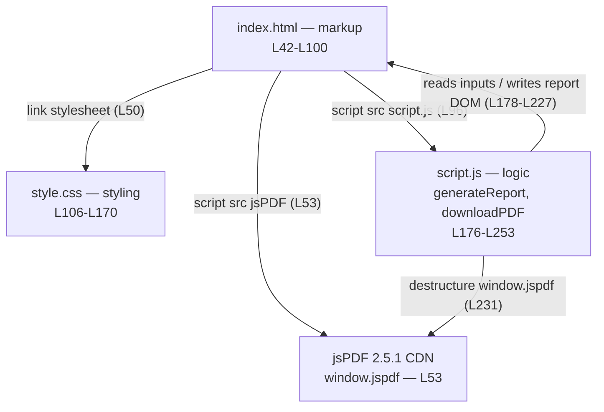

# Component Model

## Purpose

This page identifies the **logical components** of the Student Report Generator, the
**responsibilities** each one owns, and how they **relate at runtime**. The application is a
single-page, client-only utility composed of three logical components — **presentation markup**,
**presentation styling**, and **behavioral logic** — plus one **external dependency**, the jsPDF
library loaded from a CDN [Readme.md:L42-L253].

All content on this page is **code-grounded**: every technical claim carries an inline
citation back to the application source, which is embedded inside the
repository-root `Readme.md`. This page describes *what each component is and how the components
connect at runtime*; it deliberately does **not** restate the full element tables, selector
tables, or function contracts owned by the API-reference and dependency documents — it **links**
to them instead.

**Source Location:** [Readme.md:L42-L253] — the embedded `index.html`, `style.css`, and
`script.js` fenced code blocks.

---

## Components & Responsibilities

The application is built from **three logical components** plus **one external dependency**. Each
row below names the component, its role, the source line range that defines it, and the key
surface or responsibilities it owns. The full reference tables live in the linked API-reference
and dependency documents — this page summarizes and links rather than duplicating them.

| Component | Role | Source | Key Surface / Responsibilities |
|---|---|---|---|
| **`index.html`** — presentation markup | Defines the page structure: input form, action buttons, and report-card placeholders | [Readme.md:L42-L100] | Form inputs `#studentName`, `#rollNumber`, `#maths`, `#science`, `#english`, `#history`, `#computer` [Readme.md:L61-L68]; action buttons wired to `generateReport()` / `downloadPDF()` [Readme.md:L70-L71]; report-card placeholders `#rName`, `#rRoll`, `#marksTable`, `#totalMarks`, `#percentage`, `#grade` [Readme.md:L74-L93] |
| **`style.css`** — presentation styling | Static visual presentation (feature **F-008**) | [Readme.md:L106-L170] | Centered `.container` layout and `.form-section` grid; color palette (button `#007bff`, hover `#0056b3`, page background `#f4f6f8`); table styling (`border-collapse`, bordered `th`/`td`) |
| **`script.js`** — behavioral logic | Computation, on-screen rendering, and PDF export | [Readme.md:L176-L253] | Public functions `generateReport()` [Readme.md:L177-L228] and `downloadPDF()` [Readme.md:L230-L252] |
| **jsPDF 2.5.1** — external dependency | Client-side PDF generation library (cdnjs) | [Readme.md:L53] | UMD bundle loaded into `<head>`; exposes the `window.jspdf` global consumed by `downloadPDF()` [Readme.md:L231] |

### Presentation markup — `index.html`

The markup is the logical component that defines the entire page structure [Readme.md:L42-L100]. It
declares the **form inputs** the user types into — the two identity fields `#studentName` and
`#rollNumber` and the five subject-mark fields `#maths`, `#science`, `#english`, `#history`, and
`#computer` [Readme.md:L61-L68] — the two **action buttons** wired by inline `onclick` attributes
to `generateReport()` and `downloadPDF()` [Readme.md:L70-L71], and the **report-card
placeholders** that the logic writes into: `#rName`, `#rRoll`, `#marksTable`, `#totalMarks`,
`#percentage`, and `#grade` [Readme.md:L74-L93]. The markup is also the integration point for the
other components: it links the stylesheet [Readme.md:L50], loads the jsPDF CDN script
[Readme.md:L53], and loads `script.js` at the end of `<body>` [Readme.md:L96]. For the full
element/ID reference table and the button-to-function wiring, see
[`../api-reference/html-structure.md`](../api-reference/html-structure.md); this page does not
duplicate that table.

### Presentation styling — `style.css`

The styling is a **static and purely presentational** logical component — it owns feature
**F-008** and has no effect on computation or export logic [Readme.md:L106-L170]. It establishes
the layout (a centered `.container` capped at `800px` wide and a CSS-grid `.form-section` for the
inputs), the color palette (the blue action button `#007bff` darkening to `#0056b3` on hover, on a
light-grey `#f4f6f8` page background), and the marks-table styling (`border-collapse` with bordered
`th`/`td` cells). For the complete selector/style reference, the color-palette citations, and the
responsiveness note (viewport meta only; no `@media` rules), see
[`../api-reference/css-reference.md`](../api-reference/css-reference.md).

### Behavioral logic — `script.js`

The behavioral logic is the logical component that holds the application's two public functions
[Readme.md:L176-L253]. `generateReport()` reads the **form inputs**, computes the total,
percentage, and grade, and writes the results into the **rendered DOM** report card
[Readme.md:L177-L228]. `downloadPDF()` reads the **rendered DOM** report card — not the form
inputs — and exports it as a PDF via jsPDF [Readme.md:L230-L252]. Both functions are parameterless
and side-effecting. For exact signatures, the elements each function reads and writes, side
effects, and the per-function contracts, see
[`../api-reference/script-js.md`](../api-reference/script-js.md).

### External integration — jsPDF 2.5.1 (cdnjs)

jsPDF is the application's **sole external dependency** [Readme.md:L53]. It is loaded as a UMD
(minified) bundle from the cdnjs CDN by a `<script>` tag placed in the document `<head>`
[Readme.md:L53], which installs the lowercase `window.jspdf` global. Inside `downloadPDF()`, the
capitalized `jsPDF` constructor is destructured from that `window.jspdf` global [Readme.md:L231].
Because the library is pulled over the network, its availability is a **precondition** of PDF
export. For the integration contract, the CDN-availability precondition, and the version-pinning
note, see [`../dependencies.md`](../dependencies.md).

---

### Note: Logical vs. Physical Components

The project's ASCII tree advertises `index.html`, `style.css`, and `script.js` as **standalone
files** at the repository root [Readme.md:L29-L36]. In the current repository, however, these
three sources do **not** exist as separate files — they exist **embedded inside `Readme.md`**,
within language-tagged fenced code blocks [Readme.md:L42-L253]. This documentation therefore
treats them as **logical components**: distinct, named units of responsibility identified by their
source line ranges rather than by physical file boundaries. Physically extracting the embedded
code into separate `index.html`, `style.css`, and `script.js` files would be a **code change** and
is **out of scope** for this documentation effort (AAP 0.8.2). Throughout these docs, the word
"component" means a *logical component* in this sense.

---

## Component-Relationship Diagram

The diagram below shows how the markup loads the styling, the jsPDF script, and the logic script,
and how the logic reads from and writes to the markup's **rendered DOM** and calls into jsPDF.



*Diagram validated against the source load and access lines [Readme.md:L50] [Readme.md:L53] [Readme.md:L96] [Readme.md:L178-L227] [Readme.md:L231].*

The three load relationships are declared verbatim in the markup — the stylesheet link, the jsPDF
CDN script, and the trailing `script.js` include [Readme.md:L50] [Readme.md:L53] [Readme.md:L96]:

```html
<link rel="stylesheet" href="style.css">
<script src="https://cdnjs.cloudflare.com/ajax/libs/jspdf/2.5.1/jspdf.umd.min.js"></script>
<script src="script.js"></script>
```

---

## Related Documents

- [`../api-reference/script-js.md`](../api-reference/script-js.md) — `generateReport()` and `downloadPDF()` signatures and contracts.
- [`../api-reference/html-structure.md`](../api-reference/html-structure.md) — DOM element/ID reference and button wiring.
- [`../api-reference/css-reference.md`](../api-reference/css-reference.md) — selector and style-declaration reference.
- [`../dependencies.md`](../dependencies.md) — jsPDF 2.5.1 CDN integration contract and availability precondition.
- [`overview.md`](overview.md) — system context and high-level architecture.
- [`data-flow.md`](data-flow.md) — runtime data flow and per-function flowcharts.
- [`../index.md`](../index.md) — back to the Documentation Hub.
