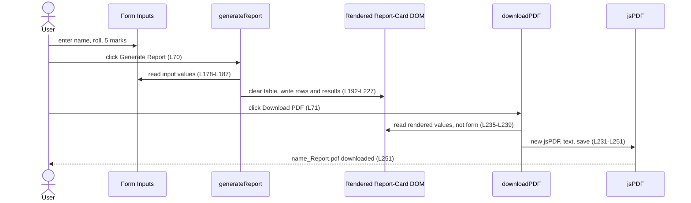
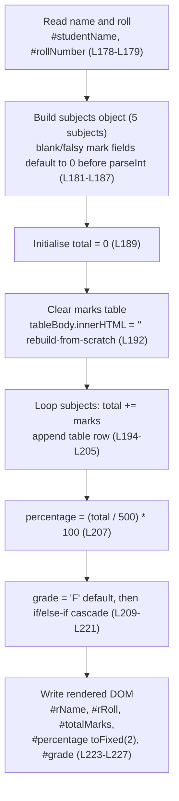
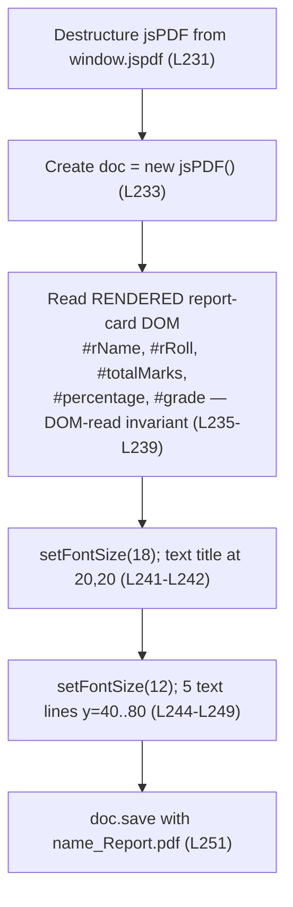

# Data Flow

## Purpose

This page describes how data moves through the **Student Report Generator**: from the
**form inputs**, through computation (total, percentage, and grade), into the **rendered
report-card DOM**, and finally into the exported PDF. It documents the application's
**end-to-end, DOM-mediated data flow** together with the per-function control flow of its two
public functions, `generateReport()` and `downloadPDF()`.

All content on this page is **code-grounded** in the application source embedded in the
repository-root `Readme.md`; every technical claim carries an inline `Readme.md` line-range
citation. This page is the **authoritative home** of the application's two function
flowcharts — Mermaid diagram **#3** (`generateReport()`) and Mermaid diagram **#4**
(`downloadPDF()`) — which sibling documents mirror for consistency.

## Source Location

`Source: [Readme.md:L176-L253]` — the embedded `script.js` fenced code block, which defines
both public functions:

- `generateReport()` — [Readme.md:L177-L228]
- `downloadPDF()` — [Readme.md:L230-L252]
- jsPDF CDN `<script>` (the dependency `downloadPDF()` relies on) — [Readme.md:L53]

---

## End-to-End Data Flow

The application is a single-page, in-browser tool with **no backend, no persistence, and no
build step**; all state lives in the DOM during a single page visit. Data flows through four
stages, and the **DOM is the medium** that connects them:

1. **Form inputs.** The user types a name, a roll number, and five subject marks into the
   `<input>` fields, then clicks **Generate Report** [Readme.md:L70].
2. **`generateReport()` — read, compute, write.** The function reads the **form inputs**
   [Readme.md:L178-L187], computes the `total`, `percentage`, and `grade`, and **writes** the
   results into the **rendered report-card DOM** [Readme.md:L192-L227].
3. **`downloadPDF()` — read the rendered DOM.** When the user clicks **Download PDF**
   [Readme.md:L71], the function reads its values from the **rendered report-card DOM** —
   **not** from the **form inputs** [Readme.md:L235-L239].
4. **jsPDF save.** The function hands those rendered values to jsPDF, which builds and saves
   the file [Readme.md:L231-L251].

The crucial architectural detail is the hand-off between stages 2 and 3: the two functions
communicate **only through the rendered DOM**, never directly.

### The DOM-read invariant

`downloadPDF()` reads the five report-card values (`#rName`, `#rRoll`, `#totalMarks`,
`#percentage`, `#grade`) from the **rendered DOM** rather than from the **form inputs**
[Readme.md:L235-L239]. This **DOM-read invariant** (also called the *DOM-read indirection*)
means `downloadPDF()` **depends on `generateReport()` having run first**: the PDF is assembled
from the *rendered* values that `generateReport()` last wrote [Readme.md:L223-L227], not from
the raw form fields. If **Download PDF** is clicked before **Generate Report**, the rendered
fields are still empty and the PDF contains blank values.

This is a **usage precondition**, not a code-enforced guard. The complete invariant — together
with all preconditions, postconditions, and error modes — is defined once in
[`../contracts/behavioral-contracts.md`](../contracts/behavioral-contracts.md) (the single
source of truth for invariants); the PDF-export feature that depends on it is documented in
[`../functionality/pdf-export.md`](../functionality/pdf-export.md). This page describes the
*flow* and links there rather than duplicating the contract.

The following sequence diagram traces a full session end to end, making the DOM-read hand-off
explicit:

---

## generateReport() Control Flow

`generateReport()` runs a single, **deterministic** top-to-bottom sequence: given identical
**form inputs** it always produces identical report-card output, with no branching beyond the
grade cascade and no external state [Readme.md:L177-L228]. The eight steps below read the form,
compute the results, and write the **rendered DOM** in one pass — including the
**rebuild-from-scratch** table clear [Readme.md:L192] and the **no-NaN guard** on every subject
field [Readme.md:L181-L187].

*Diagram #3 — validated against the source `generateReport()` definition [Readme.md:L177-L228].*
For the exact signature, parameters, and the full read/write element tables, see
[`../api-reference/script-js.md`](../api-reference/script-js.md); for the grade-cascade
thresholds and the grade-decision flowchart, see
[`../functionality/grading.md`](../functionality/grading.md).

---

## downloadPDF() Control Flow

`downloadPDF()` is also a linear sequence, but its defining step is the **DOM-read** at node
**C**: it reads the **rendered report-card DOM** (`#rName`, `#rRoll`, `#totalMarks`,
`#percentage`, `#grade`), **not** the **form inputs** [Readme.md:L235-L239]. It first
destructures the `jsPDF` constructor from the global `window.jspdf` [Readme.md:L231],
instantiates a document [Readme.md:L233], reads the rendered values, writes the title and five
body lines, and saves the file [Readme.md:L241-L251].

*Diagram #4 — validated against the source `downloadPDF()` definition [Readme.md:L230-L252].*
The saved file follows the pattern `<name>_Report.pdf`, where `name` is the value read from the
rendered `#rName` element [Readme.md:L235], [Readme.md:L251]. For the PDF-export feature and its
DOM-read invariant, see [`../functionality/pdf-export.md`](../functionality/pdf-export.md); for
the jsPDF version and the CDN-availability precondition, see
[`../dependencies.md`](../dependencies.md).

---

## Related Documents

- [`../api-reference/script-js.md`](../api-reference/script-js.md) — exact function signatures
  and contracts for `generateReport()` and `downloadPDF()`.
- [`../functionality/pdf-export.md`](../functionality/pdf-export.md) — the PDF-export feature
  (F-007) and the DOM-read invariant.
- [`../contracts/behavioral-contracts.md`](../contracts/behavioral-contracts.md) — invariants,
  preconditions, and postconditions (single source of truth).
- [`overview.md`](overview.md), [`component-model.md`](component-model.md) — sibling
  architecture documents.
- [`../index.md`](../index.md) — back to the Documentation Hub.
