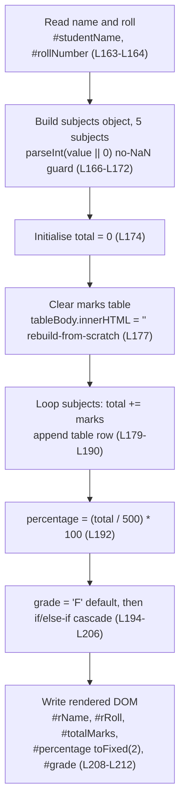
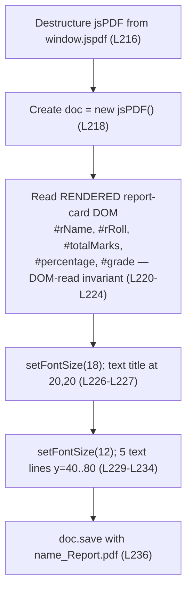

# Data Flow

> **Architecture — Data Flow.** This page documents the end-to-end, DOM-mediated data flow of the Student Report Generator and the per-function control flow of its two public functions. It hosts the **authoritative** `generateReport()` and `downloadPDF()` flowcharts that the functional and API-reference guides mirror.

## Purpose

This page describes how data moves through the **Student Report Generator**: from the **form inputs**, through computation (total, percentage, grade), into the **rendered report-card DOM**, and finally into the exported PDF. It is fully **code-grounded** — every technical claim carries an inline `[Readme.md:Lx-Ly]` citation pointing at the application source embedded in the repository-root `Readme.md`. This is a documentation-only page; it does not modify any source code.

The entire application source — `index.html`, `style.css`, and `script.js` — is embedded inside `Readme.md`; the standalone files implied by the README's project tree do not physically exist, so `Readme.md` is the sole source.

**Source:** [Readme.md:L161-L238] — the embedded `script.js` block containing both public functions.

---

## End-to-End Data Flow

The application is a single-page, DOM-mediated pipeline with **no backend, persistence, or asynchronous work**. Data flows in one direction across two discrete, user-triggered steps:

1. **Form inputs → computation → rendered DOM.** When the user clicks **Generate Report** [Readme.md:L55], `generateReport()` reads the seven **form inputs** by element ID [Readme.md:L163-L172], computes the total, percentage, and grade [Readme.md:L174-L206], and then **writes** the results into the **rendered report-card DOM** — `#rName`, `#rRoll`, `#totalMarks`, `#percentage`, and `#grade`, plus a freshly rebuilt `#marksTable` [Readme.md:L177-L212].
2. **Rendered DOM → PDF.** When the user clicks **Download PDF** [Readme.md:L56], `downloadPDF()` **reads the rendered report-card DOM** — **not** the form inputs [Readme.md:L220-L224] — lays those values onto a new jsPDF document, and saves a file [Readme.md:L216-L236].

The crucial architectural detail is that the two functions communicate **only through the rendered DOM**: `generateReport()` is the sole writer of the report-card spans, and `downloadPDF()` is a pure reader of them. The **form inputs** are never read by the export path [Readme.md:L220-L224].

### The DOM-read invariant

`downloadPDF()` reads the **rendered report-card DOM** (`#rName`, `#rRoll`, `#totalMarks`, `#percentage`, `#grade`) via `.innerText`, **not** the raw **form inputs** (`#studentName`, `#rollNumber`, `#maths`, …) [Readme.md:L220-L224]. This is the **DOM-read invariant** — the single most architecturally significant expectation in the application. Its direct consequence is an **ordering precondition**: **`generateReport()` must run before `downloadPDF()`**, because the PDF is built from the rendered values, not the raw form fields. If a user clicks Download PDF first, no error is thrown, but the PDF is populated from the still-empty rendered DOM [Readme.md:L220-L224].

This invariant and its precondition are defined authoritatively in [`../contracts/behavioral-contracts.md`](../contracts/behavioral-contracts.md) (the single source of truth for invariants), and the export feature is documented in [`../functionality/pdf-export.md`](../functionality/pdf-export.md); they are summarized here, not duplicated.

The sequence diagram below traces the full flow across both user actions. Aliases are used for the participants so the diagram avoids `()` in participant names:

*End-to-end sequence, validated against [Readme.md:L162-L237]. Note that there is no arrow from `downloadPDF` back to `Form Inputs` — the export path reads only the rendered DOM, which is the DOM-read invariant [Readme.md:L220-L224].*

---

## generateReport() Control Flow

`generateReport()` executes a fixed, **deterministic** eight-step sequence: given identical **form inputs** it always produces identical report-card output, with no randomness, time, or persistence involved [Readme.md:L162-L213]. The steps are: read identity, build the five-subject object with the **no-NaN guard**, initialise the total, **clear the marks table (rebuild-from-scratch)**, loop the subjects accumulating the total and appending rows, compute the percentage, assign the grade, and write the **rendered DOM**.

*Validated against [Readme.md:L162-L213].* For the exact function signature, parameters, and the full reads/writes contract, see [`../api-reference/script-js.md`](../api-reference/script-js.md); for the grade-assignment cascade detail and its decision flowchart, see [`../functionality/grading.md`](../functionality/grading.md).

---

## downloadPDF() Control Flow

`downloadPDF()` follows a fixed **destructure → instantiate → read → write → save** sequence. Its defining step is the **DOM-read** (node C below): it reads the **rendered report-card DOM**, not the **form inputs** [Readme.md:L220-L224]. The function destructures the `jsPDF` constructor from the `window.jspdf` CDN global [Readme.md:L216], instantiates a document [Readme.md:L218], reads the five rendered values [Readme.md:L220-L224], writes a title and five body lines at fixed coordinates [Readme.md:L226-L234], and saves the file [Readme.md:L236].

*Validated against [Readme.md:L215-L237].* The saved file follows the filename pattern `<name>_Report.pdf`, where `name` is the value read from the rendered `#rName` element [Readme.md:L220], [Readme.md:L236]. For the full export feature and the DOM-read invariant in context, see [`../functionality/pdf-export.md`](../functionality/pdf-export.md); for the jsPDF 2.5.1 CDN integration and the `window.jspdf` availability precondition, see [`../dependencies.md`](../dependencies.md).

---

## Related Documents

This page is part of a hub-and-spoke documentation set. Related references (paths relative to `docs/architecture/`):

- [`../api-reference/script-js.md`](../api-reference/script-js.md) — exact function signatures, parameters, and the full reads/writes contracts for `generateReport()` and `downloadPDF()`.
- [`../functionality/pdf-export.md`](../functionality/pdf-export.md) — the F-007 PDF export feature and the DOM-read invariant in context.
- [`../contracts/behavioral-contracts.md`](../contracts/behavioral-contracts.md) — the single source of truth for invariants, preconditions, and postconditions.
- [`overview.md`](overview.md) — system context, capabilities, and the high-level architecture diagram.
- [`component-model.md`](component-model.md) — the three logical components plus the jsPDF dependency and their relationships.
- [`../index.md`](../index.md) — back to the Documentation Hub.

---

*Maintenance note: this page is derived from the application source embedded in `Readme.md` [Readme.md:L161-L238]. If that embedded `script.js` block changes, update the cited line ranges, the prose, and both flowcharts here so this data-flow reference stays accurate. The flowcharts on this page are authoritative; the copies in [`../api-reference/script-js.md`](../api-reference/script-js.md) and [`../functionality/pdf-export.md`](../functionality/pdf-export.md) mirror them.*
