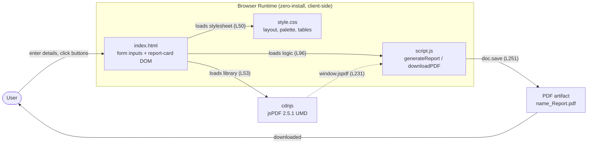

# Architecture Overview

## Purpose

This page gives the **high-level system context** for the **Student Report Generator** — a
single-page, client-only web utility that captures student details, computes a result, renders an
on-screen report card, and exports it as a PDF. It is the architectural entry point for the
documentation set: it frames the system at a glance and then hands off to the deeper
[component model](component-model.md) and [data-flow](data-flow.md) documents for detail. All
content on this page is **code-grounded** in the application source embedded in the
repository-root `Readme.md`, and every technical claim carries an inline
citation.

**Source Location:** [Readme.md:L1-L36] — the project Overview and Project Structure tree. The
full application source (`index.html`, `style.css`, and `script.js`) is embedded further down the
same file, within language-tagged fenced code blocks, at [Readme.md:L42-L253].

---

## System Context

The Student Report Generator is an **educational / utility tool** that lets a user enter student
details using a form, calculate total marks and percentage, generate a formatted student report,
and export the report as a PDF file [Readme.md:L4-L8]. There is no login, no multi-user state, and
no server round-trip; the entire workflow happens in a single browser tab during one page visit.

Architecturally, the application is deliberately minimal:

- **No backend, no persistence, no build pipeline.** The project is plain HTML, CSS, and vanilla
  JavaScript, with jsPDF as its only library [Readme.md:L272-L275]; there is nothing to compile,
  bundle, migrate, or deploy.
- **Zero-install, client-side execution.** Running the app is simply: download the project and
  open `index.html` in a browser, then enter the details, click **Generate Report**, and click
  **Download PDF** [Readme.md:L279-L283]. All logic runs in the browser.
- **One external dependency.** The only third-party library is **jsPDF 2.5.1**, loaded at runtime
  from the **cdnjs** CDN by a single `<script>` tag in the document `<head>` [Readme.md:L53]:

```html
<script src="https://cdnjs.cloudflare.com/ajax/libs/jspdf/2.5.1/jspdf.umd.min.js"></script>
```

Because jsPDF is fetched over the network, **internet access at load time is a precondition** of
the PDF-export feature. The full integration contract — the `window.jspdf` global, the
CDN-availability precondition, and the version pin — is documented in
[`../dependencies.md`](../dependencies.md) and is not duplicated here.

---

## Capability Summary

The application exposes exactly four user-facing capabilities, taken from the project Overview
[Readme.md:L4-L8]:

1. **Enter student details using a form** [Readme.md:L4-L8].
2. **Calculate total marks and percentage** [Readme.md:L4-L8].
3. **Generate a formatted student report** [Readme.md:L4-L8].
4. **Export the report as a PDF file** [Readme.md:L4-L8].

These capabilities map onto the eight features (F-001 through F-008) documented in detail under
[`../functionality/`](../functionality/data-entry.md). The detailed feature guides are the
authoritative home of each feature; this overview only points at them:

| Capability [Readme.md:L4-L8] | Feature(s) | Detailed guide |
|---|---|---|
| Enter student details using a form | **F-001** Identity Capture, **F-002** Marks Entry | [`../functionality/data-entry.md`](../functionality/data-entry.md) |
| Calculate total marks and percentage | **F-003** Total Aggregation, **F-004** Percentage | [`../functionality/computation.md`](../functionality/computation.md) |
| Generate a formatted student report | **F-005** Grade Assignment, **F-006** On-Screen Rendering | [`../functionality/grading.md`](../functionality/grading.md), [`../functionality/report-rendering.md`](../functionality/report-rendering.md) |
| Export the report as a PDF file | **F-007** PDF Export | [`../functionality/pdf-export.md`](../functionality/pdf-export.md) |

The presentation layer, **F-008 Static Visual Styling**, is cross-cutting: it styles the
**form inputs** and the **rendered DOM** report card without affecting computation or export
[Readme.md:L106-L170] (see [`../functionality/styling.md`](../functionality/styling.md)).

---

## Success Criteria

The system is working correctly when both of its outputs are correct:

- **A correct on-screen report.** After the user clicks **Generate Report**, the **rendered DOM**
  report card shows the student name and roll number, a per-subject marks table, the total, the
  percentage to two decimal places, and the grade [Readme.md:L223-L227].
- **A downloadable PDF that matches the rendered values.** After the user clicks **Download PDF**,
  the saved file `<name>_Report.pdf` contains the same name, roll number, total, percentage, and
  grade that are shown on screen [Readme.md:L235-L251].

These two criteria are linked **by construction**: `downloadPDF()` builds the PDF by reading the
**rendered DOM** report card rather than the **form inputs** [Readme.md:L235-L239], so the PDF
reflects exactly what `generateReport()` last rendered. This **DOM-read invariant** — and the
resulting precondition that **Generate Report must run before Download PDF** — is defined once in
[`../contracts/behavioral-contracts.md`](../contracts/behavioral-contracts.md) (the single source
of truth for invariants) and traced step by step in [`data-flow.md`](data-flow.md); this page
links to them rather than restating the detail.

---

## High-Level Architecture

The diagram below shows the runtime shape of the system: the **User** drives the **browser
runtime** (the `index.html` form and report-card DOM, the `script.js` logic, and the `style.css`
presentation), the markup loads **jsPDF 2.5.1** from **cdnjs**, and `downloadPDF()` produces the
downloadable **PDF artifact**.



*Diagram #1 — High-level architecture; validated against [Readme.md:L50] [Readme.md:L53] [Readme.md:L96] [Readme.md:L231] [Readme.md:L251].*

For the three logical components and the jsPDF dependency in detail, see
[`component-model.md`](component-model.md); for the end-to-end, DOM-mediated data flow and the
per-function flowcharts, see [`data-flow.md`](data-flow.md).

---

## Related Documents

- [`component-model.md`](component-model.md) — the three logical components (`index.html`,
  `style.css`, `script.js`) plus the jsPDF dependency, with the component-relationship diagram.
- [`data-flow.md`](data-flow.md) — the DOM-mediated end-to-end data flow and the per-function
  flowcharts for `generateReport()` and `downloadPDF()`.
- [`../dependencies.md`](../dependencies.md) — the jsPDF 2.5.1 CDN integration contract and the
  CDN-availability precondition.
- [`../contracts/behavioral-contracts.md`](../contracts/behavioral-contracts.md) — the behavioral
  invariants, preconditions, and postconditions (single source of truth).
- [`../index.md`](../index.md) — back to the Documentation Hub.
