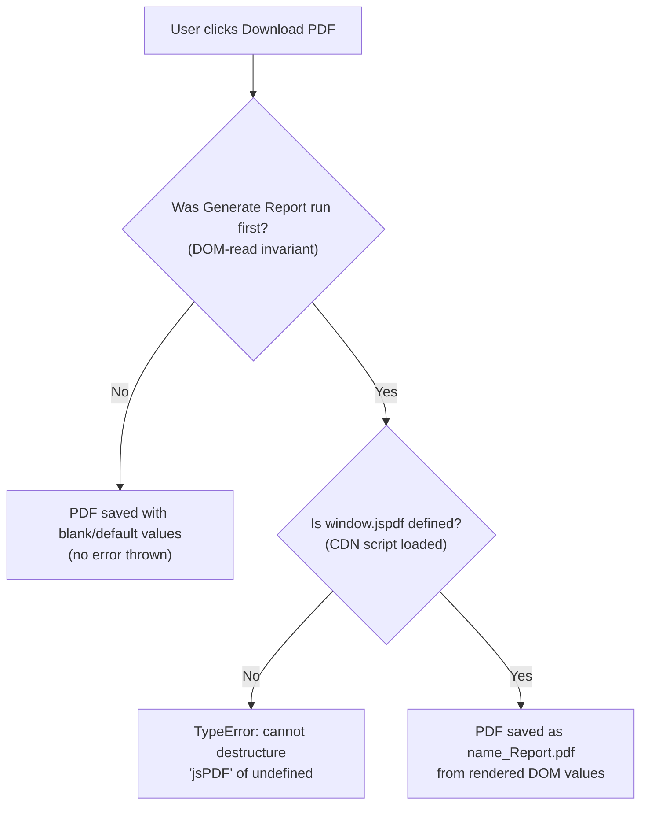

# Behavioral Contracts — The Expectation from the Code

> **Single Source of Truth (SSOT).** This page is the canonical, authoritative reference for the Student Report Generator's **behavioral contracts** — its invariants, preconditions, postconditions, error modes, and determinism guarantee. Every functional and API document **links here** for these expectations instead of restating them, so each contract is defined in exactly one place and cannot drift.

## Purpose

This document is the **single source of truth** for the application's behavioral contracts: the **invariants** it always upholds, the **preconditions** it assumes, the **postconditions** it guarantees, the **error modes** it can exhibit, and its **determinism guarantee**. It is the direct, code-grounded answer to the project's second explicit requirement — *"highlight what is the expectation from the code."*

Per the documentation set's hub-and-spoke model, downstream documents — the functional guides under [`../functionality/`](../functionality/data-entry.md) and the API reference [`../api-reference/script-js.md`](../api-reference/script-js.md) — **link to this page rather than duplicate** these contracts, which prevents the expectations from drifting between documents.

All content below is **code-grounded**: every technical claim carries an inline `[Readme.md:Lx-Ly]` citation pointing at the embedded source, and every excerpt is a short verbatim quote. The entire application source — `index.html`, `style.css`, and `script.js` — is embedded inside the repository-root `Readme.md`; the standalone files implied by the README's project tree do not physically exist, so `Readme.md` is the sole source.

## Source Location

All contracts on this page are extracted from the behavioral logic embedded in `Readme.md`:

- **Application logic** — the embedded `script.js` block [Readme.md:L161-L238]
- **`generateReport()`** — builds and renders the report card [Readme.md:L162-L213]
- **`downloadPDF()`** — exports the rendered report card to a PDF [Readme.md:L215-L237]
- **jsPDF dependency** — the CDN `<script>` tag that populates `window.jspdf` [Readme.md:L38]

---

## Invariants

The five behavioral guarantees below hold on every run, by construction of the code. The overview table summarizes each; the `###` subsections that follow give the verbatim excerpt, citation, and explanation.

| # | Invariant | Guarantee (one line) | Source |
| --- | --- | --- | --- |
| 1 | Rebuild-from-scratch rendering | The marks table is cleared and rebuilt every run, yielding exactly five rows | [Readme.md:L176-L177] |
| 2 | No-NaN guard | Blank/falsy `.value` defaults to `0` before `parseInt`, preventing blank-field `NaN`; it is **not** general validation — a truthy non-numeric `.value` can still parse to `NaN` | [Readme.md:L167-L171] |
| 3 | Fixed 2-decimal percentage precision | The *displayed* percentage is a 2-decimal string via `.toFixed(2)` | [Readme.md:L211] |
| 4 | Default grade `'F'` | `grade` starts at `'F'` and is retained when every threshold test fails | [Readme.md:L194] |
| 5 | DOM-read invariant | `downloadPDF()` reads the rendered DOM, not the form inputs | [Readme.md:L220-L224] |

### 1. Rebuild-from-scratch rendering

Before the per-subject loop runs, `generateReport()` fetches the marks-table body and **clears** it [Readme.md:L176-L177]:

```javascript
const tableBody = document.getElementById('marksTable');
tableBody.innerHTML = '';
```

The loop `for (let subject in subjects)` then re-appends one `<tr>` row per subject [Readme.md:L179-L190]. Because the table is wiped first, **every** Generate Report run produces a fresh table of **exactly five rows** (one per subject) — repeated runs never accumulate stale rows. See [`../functionality/report-rendering.md`](../functionality/report-rendering.md) (**F-006**) for the rendering walkthrough.

### 2. No-NaN guard

Each subject is read and coerced with `parseInt(document.getElementById('<id>').value || 0)` [Readme.md:L167-L171]:

```javascript
Maths: parseInt(document.getElementById('maths').value || 0),
```

The `|| 0` makes a blank or otherwise falsy `.value` default to `0` **before** `parseInt` runs, so an empty field contributes `0` rather than `NaN`. This guard is **not** a general validation mechanism: it protects **only** against blank/falsy `.value`. A **truthy non-numeric** `.value` (for example `"abc"`) is **not** guarded and would `parseInt` to `NaN`, which would then propagate into the accumulated `total`; likewise the guard does **not** clamp negative values or values greater than the per-subject maximum, because there is no range validation anywhere in the source. The (unenforced) per-subject maximum of `100` is documented in [`../reference/data-schema.md`](../reference/data-schema.md). The most precise statement of this scope is the marks-entry note in [`../functionality/data-entry.md`](../functionality/data-entry.md) (**F-002**).

### 3. Fixed 2-decimal percentage precision

The percentage written to the rendered DOM is formatted with `.toFixed(2)` [Readme.md:L211]:

```javascript
document.getElementById('percentage').innerText = percentage.toFixed(2);
```

Important nuance: the internal `total` and `percentage` are full-precision JavaScript **numbers**; only the **displayed** percentage is a 2-decimal **string** produced by `.toFixed(2)`. The stored value is **not** rounded. By contrast, `total` is written to the rendered DOM **without** any formatting [Readme.md:L210]. See [`../functionality/computation.md`](../functionality/computation.md) (**F-004**) for the percentage computation.

### 4. Default grade `'F'`

The grade variable is initialized to `'F'` before the threshold cascade runs [Readme.md:L194]:

```javascript
let grade = 'F';
```

`'F'` is **retained** whenever every `if/else-if` test fails — that is, when `percentage < 50` [Readme.md:L196-L206]. This default guarantees `grade` is never empty or `undefined`. The canonical threshold values (`≥ 90` → `A+`, … `≥ 50` → `D`) are owned by [`../reference/data-schema.md`](../reference/data-schema.md); see [`../functionality/grading.md`](../functionality/grading.md) (**F-005**) for the grade-decision flowchart.

### 5. DOM-read invariant

`downloadPDF()` reads its values from the **rendered DOM** report card (`#rName`, `#rRoll`, `#totalMarks`, `#percentage`, `#grade`) via `.innerText`, **not** from the **form inputs** (`#studentName`, `#rollNumber`, `#maths`, …) [Readme.md:L220-L224]:

```javascript
const name = document.getElementById('rName').innerText;
```

This is the single most architecturally significant expectation in the application: the exported PDF mirrors whatever the **rendered DOM** currently shows. It is precisely why **Generate Report must run before Download PDF** (see [Preconditions](#preconditions)). See [`../functionality/pdf-export.md`](../functionality/pdf-export.md) (**F-007**) and [`../api-reference/script-js.md`](../api-reference/script-js.md) for the export reference.

---

## Preconditions

These conditions must hold for the application to behave as expected. **Neither is enforced in code** — both are usage/runtime expectations.

| Precondition | Why it is required | Source |
| --- | --- | --- |
| **Generate Report runs before Download PDF** | `downloadPDF()` reads the **rendered DOM**, not the **form inputs** (the DOM-read invariant). If the report card was never rendered, the read values are empty/default and the PDF contains blank values. | [Readme.md:L220-L224] |
| **`window.jspdf` is populated before `downloadPDF()`** | `downloadPDF()` destructures `const { jsPDF } = window.jspdf;`. That global is supplied by the jsPDF CDN `<script>` tag, which must have loaded first. | [Readme.md:L38], [Readme.md:L216] |

**Ordering.** `generateReport()` (the **Generate Report** button) must run before `downloadPDF()` (the **Download PDF** button). There is **no code guard** enforcing this order — it is a direct consequence of the DOM-read invariant [Readme.md:L220-L224]. If a user clicks Download PDF first, no error is thrown, but the PDF is populated from the still-empty rendered DOM.

**jsPDF present.** The global `window.jspdf` must be populated by the CDN script [Readme.md:L38] before `downloadPDF()` destructures it [Readme.md:L216]:

```javascript
const { jsPDF } = window.jspdf;
```

This requires the cdnjs script to have loaded successfully (i.e., internet access at page load). The CDN-availability contract is documented in [`../dependencies.md`](../dependencies.md).

---

## Postconditions

| After … | Guaranteed result | Source |
| --- | --- | --- |
| `generateReport()` | The report card is populated — `#rName`, `#rRoll`, `#totalMarks`, `#percentage`, and `#grade` are written — and the marks table holds exactly five rows. | [Readme.md:L208-L212], [Readme.md:L179-L190] |
| `downloadPDF()` | A PDF is generated and downloaded, named `${name}_Report.pdf`, populated from the rendered DOM values. | [Readme.md:L236], [Readme.md:L220-L234] |

- **After `generateReport()`** — the five report-card fields are written to the rendered DOM [Readme.md:L208-L212], and the marks table contains exactly five rows, one per subject [Readme.md:L179-L190].
- **After `downloadPDF()`** — the browser saves a PDF named `${name}_Report.pdf` [Readme.md:L236], where `name` is read from the rendered `#rName`; all five fields in the PDF are taken from the rendered DOM [Readme.md:L220-L234].

---

## Error Modes

- **`TypeError` when `window.jspdf` is `undefined`.** If the jsPDF CDN script is unreachable, blocked, or has not yet loaded (for example, `downloadPDF()` runs offline or before the `<script>` tag executes), the destructuring line throws a `TypeError` — *cannot destructure property `jsPDF` of `undefined`* [Readme.md:L216]:

```javascript
const { jsPDF } = window.jspdf;
```

- **No programmatic error handling anywhere.** There is **no** `try/catch` block and **no** input validation beyond the `|| 0` no-NaN guard anywhere in the code [Readme.md:L161-L238]. Any failure surfaces only in the browser console; nothing is caught, retried, or reported to the user.
- **"Download before Generate" produces a blank PDF, not an error.** Because of the DOM-read invariant, clicking Download PDF before Generate Report throws **no** error — but the rendered DOM was never populated, so the saved PDF contains blank/default field values [Readme.md:L220-L224].

---

## Determinism Guarantee

- **`generateReport()` is a pure function of its inputs.** Given identical **form inputs**, it always produces identical report-card output. The logic reads only the form inputs and writes only to the rendered DOM — there is no randomness, no use of time/`Date`, no persistence, and no external reads anywhere in `generateReport()` [Readme.md:L162-L213].
- **Grade assignment is total and mutually exclusive.** Every `percentage` maps to **exactly one** grade. The ordered `if/else-if` cascade [Readme.md:L196-L206] tests the highest band first, so each band's upper bound (`< 90`, `< 80`, …) is an **implicit** consequence of the ordering rather than an explicit comparison; the `'F'` default [Readme.md:L194] catches every `percentage < 50`. There are no gaps and no overlaps — the mapping is total. The canonical threshold values live in [`../reference/data-schema.md`](../reference/data-schema.md), and the grade-decision flowchart is in [`../functionality/grading.md`](../functionality/grading.md).

---

## Contract Gate — `downloadPDF()`

The minimal flowchart below summarizes the two preconditions that gate a successful PDF export and the outcome when each is not met. (The authoritative, full end-to-end flow diagrams live in [`../architecture/data-flow.md`](../architecture/data-flow.md) and [`../functionality/pdf-export.md`](../functionality/pdf-export.md); this diagram is intentionally contract-focused and not a duplicate of those.)



---

## Related Documents

- [Documentation Hub](../index.md) — back to the master table of contents.
- [API Reference — script.js](../api-reference/script-js.md) — exact signatures, DOM reads/writes, and side effects for `generateReport()` and `downloadPDF()`.
- [Data Entry (F-001, F-002)](../functionality/data-entry.md) — identity capture and marks entry; the no-NaN guard in context.
- [Computation (F-003, F-004)](../functionality/computation.md) — total aggregation and the percentage formula.
- [Grading (F-005)](../functionality/grading.md) — grade assignment and the grade-decision flowchart.
- [Report Rendering (F-006)](../functionality/report-rendering.md) — on-screen rendering and the rebuild-from-scratch invariant.
- [PDF Export (F-007)](../functionality/pdf-export.md) — PDF export and the DOM-read invariant.
- [Reference — Fixed Data Schema](../reference/data-schema.md) — canonical fixed values (subjects, 500-point denominator, grade thresholds).
- [Dependencies](../dependencies.md) — jsPDF 2.5.1 CDN integration and the CDN-availability precondition.

---

*Maintenance note: this document is derived from the application source embedded in `Readme.md` [Readme.md:L161-L238]. If that embedded code changes, update the cited line ranges and contract statements here so this single source of truth stays accurate.*
