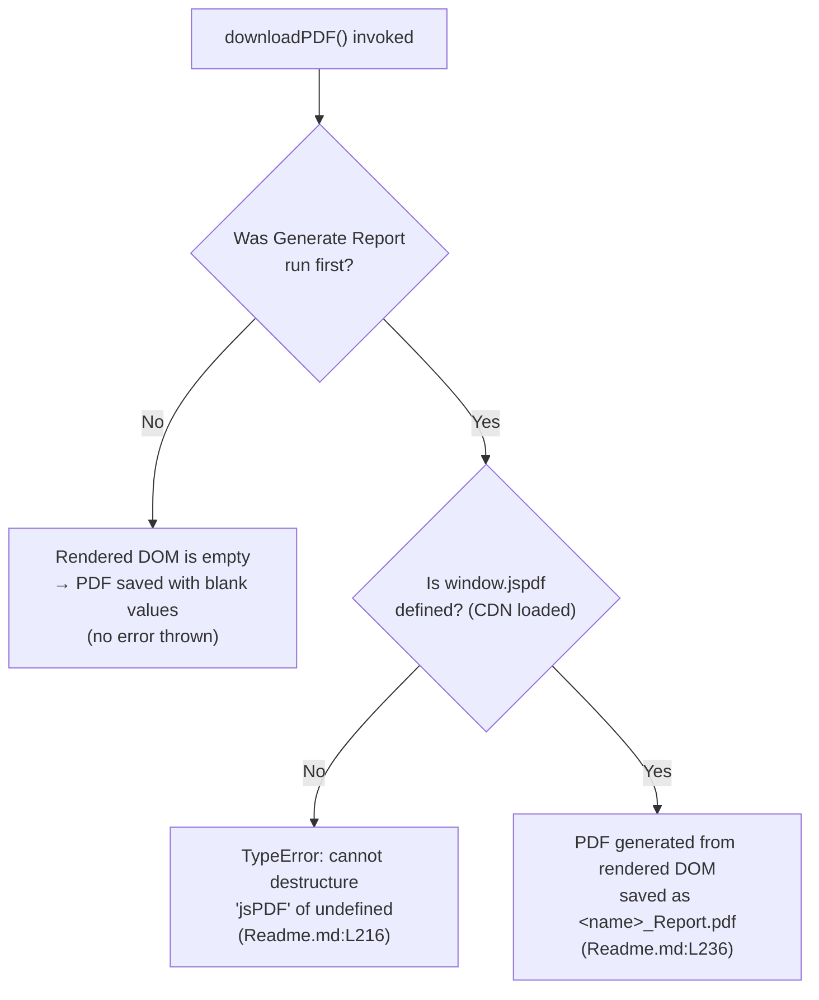

# Behavioral Contracts — The Expectation from the Code

## Purpose

This page is the **single source of truth (SSOT)** for the Student Report Generator's
**behavioral contracts** — its **invariants**, **preconditions**, **postconditions**,
**error modes**, and **determinism guarantee**. It is the direct, code-grounded answer to the
question *"what is the expectation from the code?"*: every guarantee documented here is a
property the application source actually exhibits, not an aspiration.

To prevent drift, the other documents do **not** restate these contracts. The
[API reference](../api-reference/script-js.md) and the functionality guides
([data-entry](../functionality/data-entry.md),
[computation](../functionality/computation.md),
[grading](../functionality/grading.md),
[report-rendering](../functionality/report-rendering.md),
[pdf-export](../functionality/pdf-export.md)) **link here** for invariants rather than
duplicating them. Conversely, the canonical *fixed values* (subjects, the `500`-point
denominator, and the grade thresholds) are owned by
[`../reference/data-schema.md`](../reference/data-schema.md); this page references and
summarizes them but does not re-assert them as authoritative.

All content below is **code-grounded**: every technical claim carries an inline
`[Readme.md:Lx-Ly]` citation back to the application source, which is embedded in the
repository-root `Readme.md`. Code excerpts are short, verbatim quotations of the cited lines.

## Source Location

The behavior described here lives in the embedded `script.js` block [Readme.md:L161-L238],
which defines the two public functions of the application:

- `generateReport()` — reads the **form inputs**, computes the result, and writes the
  **rendered DOM** report card [Readme.md:L162-L213].
- `downloadPDF()` — reads the **rendered DOM** report card and saves a PDF [Readme.md:L215-L237].

The PDF capability depends on the jsPDF library, loaded by a CDN `<script>` tag in the page
head [Readme.md:L38].

---

## Invariants

The application makes five behavioral guarantees. Each holds for every successful
`generateReport()` run (invariants 1–4) or every `downloadPDF()` run (invariant 5).

| # | Invariant | Guarantee (one line) | Source |
|---|---|---|---|
| 1 | Rebuild-from-scratch rendering | The marks table is cleared before re-population, so each run yields a fresh table of exactly five rows. | [Readme.md:L176-L177] |
| 2 | No-NaN guard | `parseInt(... .value \|\| 0)` defaults a blank/falsy mark field to `0` before parsing, so an empty field contributes `0` rather than `NaN`. | [Readme.md:L167-L171] |
| 3 | Fixed 2-decimal percentage precision | The *displayed* percentage is a 2-decimal string via `.toFixed(2)`; the internal value stays a full-precision number. | [Readme.md:L211] |
| 4 | Default grade `'F'` | `grade` is initialized to `'F'` and retained whenever every threshold test fails (percentage `< 50`). | [Readme.md:L194] |
| 5 | DOM-read invariant | `downloadPDF()` reads from the **rendered DOM** report card, **not** from the **form inputs**. | [Readme.md:L220-L224] |

---

### 1. Rebuild-from-scratch rendering

Before the per-subject loop runs, `generateReport()` fetches the marks table body and clears
its contents [Readme.md:L176-L177]:

```javascript
const tableBody = document.getElementById('marksTable');
tableBody.innerHTML = '';
```

The loop `for (let subject in subjects)` then appends exactly one `<tr>` row per subject
[Readme.md:L179-L190]. Because the table is emptied first, **rebuild-from-scratch** guarantees
that every Generate Report run produces a fresh table of **exactly five rows** (one per
subject) — repeated runs never accumulate stale or duplicate rows. The on-screen rendering
behavior is documented in
[`../functionality/report-rendering.md`](../functionality/report-rendering.md) (feature
**F-006**).

---

### 2. No-NaN guard

Each of the five subjects is read and coerced with the **no-NaN guard** — the `|| 0` inside the
`parseInt(...)` call [Readme.md:L167-L171]:

```javascript
Maths: parseInt(document.getElementById('maths').value || 0),
```

The `|| 0` makes a blank or otherwise falsy `.value` default to `0` **before** `parseInt`
runs, so each subject value — and therefore the accumulated `total` — is always a number and
never `NaN` from an empty field [Readme.md:L166-L172]. Note the precise scope of this guard:
it only protects against a blank/falsy field. It does **not** clamp negative numbers and does
**not** enforce the per-subject maximum of `100` — there is **no range validation anywhere** in
the code (entering `250` for one subject is accepted and flows straight into `total`). The
unenforced per-subject maximum is documented in
[`../reference/data-schema.md`](../reference/data-schema.md). This behavior belongs to feature
**F-002 (Marks Entry)**, documented in
[`../functionality/data-entry.md`](../functionality/data-entry.md).

---

### 3. Fixed 2-decimal percentage precision

When the result is written to the report card, the percentage is formatted with `.toFixed(2)`
[Readme.md:L211]:

```javascript
document.getElementById('percentage').innerText = percentage.toFixed(2);
```

This guarantees the **displayed** percentage always shows exactly two decimal places. The
important nuance: only the *displayed* value is rounded. The internal `total` and `percentage`
are JavaScript **numbers** at full precision — `.toFixed(2)` produces a 2-decimal **string**
purely for display and does not change the stored value. In contrast, `total` is written to the
DOM **without** any formatting [Readme.md:L210]:

```javascript
document.getElementById('totalMarks').innerText = total;
```

The computation behind these values is documented in
[`../functionality/computation.md`](../functionality/computation.md) (feature **F-004**).

---

### 4. Default grade `'F'`

The grade variable is initialized to `'F'` before any threshold is tested [Readme.md:L194]:

```javascript
let grade = 'F';
```

`grade` is then potentially reassigned by an ordered `if / else-if` cascade [Readme.md:L196-L206].
If **every** test fails — i.e., the percentage is below `50` — the initial `'F'` is
**retained**. This default is the catch-all that guarantees `grade` is never empty or
`undefined`. The canonical threshold values (≥ 90 → `A+`, … , ≥ 50 → `D`) are owned by
[`../reference/data-schema.md`](../reference/data-schema.md); this page documents only the
*behavioral* fact that `'F'` is the initialized default and the cascade fall-through. Grade
assignment is feature **F-005**, documented in
[`../functionality/grading.md`](../functionality/grading.md).

---

### 5. DOM-read invariant

`downloadPDF()` reads its values from the **rendered DOM** report card — `#rName`, `#rRoll`,
`#totalMarks`, `#percentage`, and `#grade` — via `.innerText`, **not** from the **form inputs**
(`#studentName`, `#rollNumber`, `#maths`, …) [Readme.md:L220-L224]:

```javascript
const name = document.getElementById('rName').innerText;
```

This **DOM-read invariant** is the single most architecturally significant expectation of the
application. Because the PDF is built from the *rendered* report card rather than the form,
`generateReport()` **must** have run first to populate that report card — which is exactly why
the [ordering precondition](#preconditions) below exists. PDF export is feature **F-007**,
documented in [`../functionality/pdf-export.md`](../functionality/pdf-export.md) with exact
signatures in [`../api-reference/script-js.md`](../api-reference/script-js.md).

---

## Preconditions

Two conditions must hold for the application to behave as expected. Neither is enforced by a
code guard — both are **usage expectations** that the code assumes.

| Precondition | Why it is required | Source |
|---|---|---|
| **Ordering: Generate Report before Download PDF** | `downloadPDF()` reads the **rendered DOM** report card, so that report card must already be populated by a prior `generateReport()` run. Otherwise the rendered fields are empty/default and the PDF contains blank values. | [Readme.md:L220-L224] |
| **jsPDF present** | `downloadPDF()` destructures the global `window.jspdf`; the cdnjs `<script>` must have loaded and populated that global before the function runs. | [Readme.md:L38], [Readme.md:L216] |

**Ordering.** The user must click **Generate Report** before **Download PDF**. This is a direct
consequence of the [DOM-read invariant](#5-dom-read-invariant) [Readme.md:L220-L224]: the PDF is
assembled from the *rendered* report card, not the **form inputs**. There is **no code guard**
enforcing this order — nothing disables the Download button or checks that a report exists, so
the ordering is purely a usage expectation.

**jsPDF present.** Before `downloadPDF()` runs the destructuring assignment
`const { jsPDF } = window.jspdf;` [Readme.md:L216], the global `window.jspdf` must have been
populated by the CDN script tag [Readme.md:L38]:

```javascript
const { jsPDF } = window.jspdf;
```

This requires the cdnjs script to have loaded successfully (i.e., internet access at page
load). The CDN-availability contract is documented in
[`../dependencies.md`](../dependencies.md).

---

## Postconditions

The guaranteed observable outcomes after each function completes successfully.

| Function | Postcondition | Source |
|---|---|---|
| `generateReport()` | The report card is populated: `#rName`, `#rRoll`, `#totalMarks`, `#percentage`, and `#grade` are all written. | [Readme.md:L208-L212] |
| `generateReport()` | The marks table contains **exactly five rows** — one per subject. | [Readme.md:L179-L190] |
| `downloadPDF()` | A PDF is generated and downloaded, named ``${name}_Report.pdf``. | [Readme.md:L236] |
| `downloadPDF()` | The PDF content is populated from the **rendered DOM** values, not the form inputs. | [Readme.md:L220-L234] |

After `generateReport()`, all five report-card fields are written in a single pass
[Readme.md:L208-L212], and the marks table holds exactly five rows because of the
[rebuild-from-scratch invariant](#1-rebuild-from-scratch-rendering) [Readme.md:L179-L190].

After `downloadPDF()`, the browser saves a file whose name is derived from the rendered name
field [Readme.md:L236]:

```javascript
doc.save(`${name}_Report.pdf`);
```

Here `name` is read from the rendered `#rName` element [Readme.md:L220], so the filename
reflects whatever `generateReport()` last wrote — another consequence of the
[DOM-read invariant](#5-dom-read-invariant).

---

## Error Modes

The application performs **no programmatic error handling**. The following failure behaviors
are therefore the expected (unguarded) outcomes.

- **Missing jsPDF → `TypeError`.** If `window.jspdf` is `undefined` — the CDN is unreachable,
  blocked, or offline, or `downloadPDF()` somehow runs before the script has loaded — the
  destructuring line [Readme.md:L216] throws a `TypeError` (cannot destructure property
  `jsPDF` of `undefined`). There is no surrounding `try/catch`, so the error surfaces only in
  the browser console.
- **No try/catch, no input validation.** There is **no** `try/catch` anywhere and **no** input
  validation beyond the [no-NaN guard](#2-no-nan-guard) (`|| 0`) [Readme.md:L161-L238].
  Out-of-range marks (negative, or above the per-subject maximum of `100`) are accepted without
  complaint; see [`../reference/data-schema.md`](../reference/data-schema.md) for the unenforced
  maximum.
- **Download before Generate → blank PDF (no error thrown).** If **Download PDF** is clicked
  before **Generate Report**, no exception is raised: the rendered report card was never
  populated, so the [DOM-read invariant](#5-dom-read-invariant) [Readme.md:L220-L224] yields
  empty strings, and the resulting PDF simply contains blank/default field values.

---

## Determinism Guarantee

`generateReport()` is a **deterministic function of its current form inputs**: given identical
**form inputs**, it always produces identical report-card output. The code reads only the form fields and writes
only the report card [Readme.md:L162-L213] — there is no randomness, no `Date`/time dependency,
no persistence, and no external read, so the output depends solely on the entered values.

Grade assignment is **total and mutually exclusive**: every percentage maps to **exactly one**
grade. The ordered `if / else-if` cascade [Readme.md:L196-L206] tests the highest band first,
so each band's upper bound is **implicit** — for example, `A` applies only when the percentage
is `>= 80` *and* the `>= 90` test has already failed; there is no literal `< 90` comparison in
the source. The `'F'` default [Readme.md:L194] catches every percentage below `50`. Together
these mean the mapping has **no gaps and no overlaps**. The canonical threshold values live in
[`../reference/data-schema.md`](../reference/data-schema.md), and the grade-decision flowchart
lives in [`../functionality/grading.md`](../functionality/grading.md).

---

## Contract Gate (downloadPDF)

The diagram below summarizes the two preconditions as a single contract gate for
`downloadPDF()`. The authoritative end-to-end flow diagrams live in
[`../architecture/data-flow.md`](../architecture/data-flow.md) and
[`../functionality/pdf-export.md`](../functionality/pdf-export.md); this is intentionally a
minimal, contract-focused view.



---

## Related Documents

- [Script.js API Reference](../api-reference/script-js.md) — exact function signatures, DOM
  reads/writes, and side effects for `generateReport()` and `downloadPDF()`.
- [Data Entry](../functionality/data-entry.md) — F-001 identity capture and F-002 marks entry
  (the **no-NaN guard**).
- [Computation](../functionality/computation.md) — F-003 total and F-004 percentage (the
  `.toFixed(2)` precision invariant).
- [Grading](../functionality/grading.md) — F-005 grade assignment and the grade-decision
  flowchart.
- [Report Rendering](../functionality/report-rendering.md) — F-006 on-screen rendering (the
  **rebuild-from-scratch** invariant).
- [PDF Export](../functionality/pdf-export.md) — F-007 PDF export (the **DOM-read invariant**).
- [Data Schema](../reference/data-schema.md) — canonical fixed values: subjects, the `500`
  denominator, and the grade thresholds.
- [Dependencies](../dependencies.md) — jsPDF 2.5.1 CDN integration and the availability
  precondition.
- [Documentation Hub](../index.md) — back to the master table of contents.

