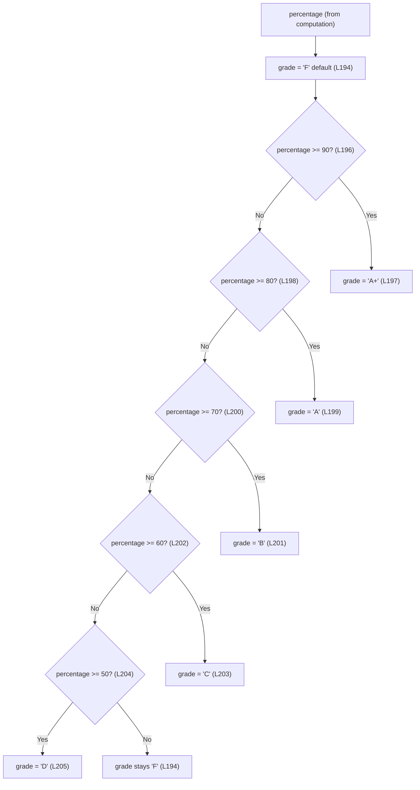

# Grading

## Purpose

This guide documents feature **F-005 (Grade Assignment)** of the Computation layer: how the
computed `percentage` is mapped to exactly one letter grade by an ordered `if / else-if`
threshold cascade that defaults to the **default grade `'F'`** [Readme.md:L194-L206]. Like
every page in this documentation set, it is code-grounded — every technical claim carries an
inline `[Readme.md:Lx-Ly]` citation back to the application source embedded in the
repository-root `Readme.md`.

---

## Source Location

- **Grade cascade (default + thresholds):** [Readme.md:L194-L206]
- **DOM write (grade rendered to the report card):** [Readme.md:L212]
- **Upstream input (`percentage`):** [Readme.md:L192]

The grade-assignment logic lives entirely inside `generateReport()`, immediately after the
`percentage` is computed [Readme.md:L192] and immediately before the results are written to the
rendered DOM [Readme.md:L208-L212].

---

## F-005 Grade Assignment

Grade assignment is **deterministic** and runs in two steps. First, `grade` is initialized to
the **default grade `'F'`** [Readme.md:L194]. Second, an ordered `if / else-if` cascade tests
`percentage` against six descending thresholds and reassigns `grade` for the **first** matching
branch [Readme.md:L196-L206]. Because the chain is a single `if / else-if` ladder, evaluation
stops at the first satisfied condition, so each `percentage` selects exactly one branch.

```javascript
let grade = 'F';

if (percentage >= 90) {
    grade = 'A+';
} else if (percentage >= 80) {
    grade = 'A';
} else if (percentage >= 70) {
    grade = 'B';
} else if (percentage >= 60) {
    grade = 'C';
} else if (percentage >= 50) {
    grade = 'D';
}
```

The resulting `grade` is then written to the rendered DOM at the `#grade` placeholder
[Readme.md:L212].

### Implicit upper bounds

Each band's **upper bound is implicit** — it is a consequence of the ordered `else if` chain,
not an explicit comparison in the source [Readme.md:L196-L206]. A higher band is always tested
first, so a lower band can only be reached after every higher test has already failed. For
example, the `A` branch is taken only when `percentage >= 80` **and** the preceding
`percentage >= 90` test already failed — i.e. when `percentage` is `>= 80 and < 90`
[Readme.md:L198-L199]. There is **no literal `< 90` comparison** anywhere in the code, so
readers should not expect one; the same reasoning gives every band the half-open range
`[lower threshold, next-higher threshold)`.

---

## Threshold Rubric

The cascade defines six grade bands, listed highest to lowest. The upper bound of each band is
implicit (see [Implicit upper bounds](#implicit-upper-bounds) above).

| Grade | Percentage Range | Source |
|---|---|---|
| `A+` | ≥ 90 | [Readme.md:L196-L197] |
| `A` | ≥ 80 and < 90 | [Readme.md:L198-L199] |
| `B` | ≥ 70 and < 80 | [Readme.md:L200-L201] |
| `C` | ≥ 60 and < 70 | [Readme.md:L202-L203] |
| `D` | ≥ 50 and < 60 | [Readme.md:L204-L205] |
| `F` | < 50 (default) | [Readme.md:L194] |

> **Single source of truth:** [`../reference/data-schema.md`](../reference/data-schema.md) is
> the authoritative reference for these threshold **values**. The table above mirrors it for
> reader convenience; if the two ever disagree, the data-schema reference is authoritative
> (AAP 0.5.5).

---

## Grade-Decision Flowchart

The flowchart traces the exact branch order of the cascade: `percentage` enters with `grade`
pre-set to the default `'F'`, then falls through the `>= 90 / 80 / 70 / 60 / 50` tests, taking
the first that succeeds and otherwise retaining `'F'`.



*Flowchart validated against [Readme.md:L194-L206].*

---

## Expected Behavior / Contract

| Aspect | Expectation |
|---|---|
| **Input** | A single numeric `percentage`, produced upstream by F-004 as `(total / 500) * 100` [Readme.md:L192]. |
| **Output** | Exactly one letter-grade string (`'A+'`, `'A'`, `'B'`, `'C'`, `'D'`, or `'F'`) assigned to the local `grade` variable [Readme.md:L194-L206] and written to the rendered DOM at `#grade` [Readme.md:L212]. |
| **Determinism / totality** | Every `percentage` maps to **exactly one** grade. The ordered cascade is mutually exclusive (the implicit upper bounds prevent overlap) and the `'F'` default makes it total — no gaps and no overlaps [Readme.md:L194-L206]. |
| **Default `'F'` retained** | When every threshold test fails (`percentage < 50`, including the `0` that results from all-blank inputs), `grade` keeps its initial value `'F'` [Readme.md:L194]. The default guarantees `grade` is never empty or `undefined`. |
| **Boundary behavior (maps UP)** | All comparisons use `>=`, so exact boundaries map to the **higher** grade: exactly `90 → A+`, exactly `80 → A`, …, exactly `50 → D` [Readme.md:L196-L204]. A value just under a threshold (e.g. `49.99`) falls to the band below. |
| **No clamping** | Marks are unvalidated and uncapped, so `percentage` is **not** constrained to `[0, 100]`. A `percentage > 100` still yields `A+` and a negative `percentage` still yields `F` [Readme.md:L194-L206]. The full no-input-validation invariant is owned by [`../contracts/behavioral-contracts.md`](../contracts/behavioral-contracts.md). |
| **Side effects** | None beyond the single DOM write at `#grade` [Readme.md:L212]; grade assignment performs no I/O, network, or persistence. |
| **Error modes** | None internal to grade assignment — the cascade contains no operations that can throw, so any `percentage` resolves to a grade [Readme.md:L194-L206]. Upstream, the `\|\| 0` no-NaN guard ensures `percentage` is always numeric (see [`../reference/data-schema.md`](../reference/data-schema.md)). |

**Worked examples** (illustrating boundary and default behavior):

| `percentage` | First matching test | Resulting grade |
|---|---|---|
| `95.00` | `>= 90` | `A+` |
| `90.00` | `>= 90` (exact boundary maps up) | `A+` |
| `72.40` | `>= 70` | `B` |
| `50.00` | `>= 50` (exact boundary maps up) | `D` |
| `0.00` (all-blank inputs) | none match | `F` (default retained) |

> **Determinism guarantee:** [`../contracts/behavioral-contracts.md`](../contracts/behavioral-contracts.md)
> is the single source of truth for the "exactly one grade per `percentage`" determinism
> guarantee and the default-`'F'` invariant.

---

## Related Documents

- [`../reference/data-schema.md`](../reference/data-schema.md) — canonical grade thresholds
  (single source of truth for the threshold values).
- [`../contracts/behavioral-contracts.md`](../contracts/behavioral-contracts.md) — the
  determinism guarantee and the default-`'F'` invariant.
- [`computation.md`](computation.md) — the upstream `percentage` (F-004) consumed by grade
  assignment.
- [`report-rendering.md`](report-rendering.md) — where the `grade` is written to the rendered
  DOM (`#grade`).
- [`../index.md`](../index.md) — back to the Documentation Hub.
