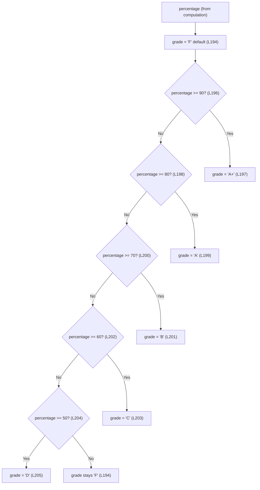

# Grading

> **Feature F-005 — Grade Assignment (Computation layer).** This guide documents how the computed `percentage` is mapped to a single letter grade.

## Purpose

This guide documents **F-005 Grade Assignment**: how the numeric `percentage` produced by the computation step is mapped to **exactly one** letter grade through an ordered `if/else-if` threshold cascade that defaults to the **default grade `'F'`** [Readme.md:L194-L206]. All content is code-grounded in the application source embedded in the repository-root `Readme.md`; the resulting grade is written to the rendered DOM at `#grade` [Readme.md:L212].

---

## Source Location

All behavior described here is extracted from the `generateReport()` logic embedded in `Readme.md`:

- **Grade cascade** (default grade `'F'` + ordered `>=` thresholds): [Readme.md:L194-L206]
- **DOM write** of the final grade to `#grade`: [Readme.md:L212]
- **Upstream input** — the `percentage` value that drives the cascade: [Readme.md:L192]

---

## F-005 Grade Assignment

The grade variable is **initialized to the default grade `'F'`** [Readme.md:L194] *before* any threshold is tested. An ordered `if/else-if` cascade then reassigns `grade` to the **first** band whose `>=` test succeeds [Readme.md:L196-L206]:

```javascript
let grade = 'F';

if (percentage >= 90) {
    grade = 'A+';
} else if (percentage >= 80) {
    grade = 'A';
} else if (percentage >= 70) {
    grade = 'B';
} else if (percentage >= 60) {
    grade = 'C';
} else if (percentage >= 50) {
    grade = 'D';
}
```

Because the chain uses `else if`, each band is tested **only after every higher band has already failed**. The upper bound of every band is therefore **implicit** — it is a consequence of evaluation order, not a literal comparison written in the code [Readme.md:L196-L206]. For example, the `A` branch (`percentage >= 80`) [Readme.md:L198-L199] is reached **only when** the earlier `percentage >= 90` test [Readme.md:L196] has already failed, so `A` effectively means **`>= 80` and `< 90`**. Reading the cascade top to bottom, the effective ranges are:

- `A+` — `percentage >= 90`, with no upper bound [Readme.md:L196-L197]
- `A` — `percentage >= 80` and `< 90` [Readme.md:L198-L199]
- `B` — `percentage >= 70` and `< 80` [Readme.md:L200-L201]
- `C` — `percentage >= 60` and `< 70` [Readme.md:L202-L203]
- `D` — `percentage >= 50` and `< 60` [Readme.md:L204-L205]
- `F` — `percentage < 50`, the retained default grade [Readme.md:L194]

> **Note:** there is no literal `< 90`, `< 80`, … anywhere in the source. Do not expect explicit upper-bound comparisons — the bounds emerge purely from the ordered `else if` structure [Readme.md:L196-L206].

**Worked example.** A `total` of `380` produces `percentage = (380 / 500) * 100 = 76` [Readme.md:L192]. That value fails `>= 90` and `>= 80` but satisfies `>= 70`, so the cascade assigns `grade = 'B'` [Readme.md:L200-L201] and writes `B` to `#grade` [Readme.md:L212].

---

## Threshold Rubric

The complete grade rubric, highest band to lowest:

| Grade | Percentage Range | Source |
| --- | --- | --- |
| `A+` | `≥ 90` | [Readme.md:L196-L197] |
| `A` | `≥ 80 and < 90` | [Readme.md:L198-L199] |
| `B` | `≥ 70 and < 80` | [Readme.md:L200-L201] |
| `C` | `≥ 60 and < 70` | [Readme.md:L202-L203] |
| `D` | `≥ 50 and < 60` | [Readme.md:L204-L205] |
| `F` | `< 50` (default) | [Readme.md:L194] |

> **Single source of truth.** The canonical threshold **values** are owned by [`../reference/data-schema.md`](../reference/data-schema.md). The table above mirrors that schema for reader convenience; if the two ever disagree, `../reference/data-schema.md` is authoritative.

---

## Grade-Decision Flowchart

The following flowchart mirrors the ordered cascade exactly — each decision node corresponds to one `>=` test in the source, and the `No` path out of the lowest test retains the default grade `'F'`:



*Flowchart validated against the grade cascade [Readme.md:L194-L206].*

---

## Expected Behavior / Contract

> This block states the **expectation from the code** for F-005. The authoritative **determinism** guarantee and the full invariant catalogue live in [`../contracts/behavioral-contracts.md`](../contracts/behavioral-contracts.md).

| Aspect | Contract |
| --- | --- |
| **Input** | A single numeric `percentage` produced by F-004 (`percentage = (total / 500) * 100`) [Readme.md:L192]. |
| **Output** | Exactly one letter-grade **string** — one of `'A+'`, `'A'`, `'B'`, `'C'`, `'D'`, or `'F'` — written to the rendered DOM at `#grade` [Readme.md:L212]. |
| **Determinism / totality** | Every `percentage` maps to **exactly one** grade. The ordered cascade is mutually exclusive (the implicit upper bounds prevent overlap) and the default grade `'F'` makes it total — there are **no gaps and no overlaps** [Readme.md:L194-L206]. |
| **Default `'F'` retained** | When every `>=` test fails — i.e. `percentage < 50`, including the `0` that all-blank inputs yield through the percentage formula [Readme.md:L192] — the initial value set at `let grade = 'F';` is retained [Readme.md:L194], so `grade` is never empty or `undefined`. |
| **Edge / boundary values** | Boundaries map **up**, because every comparison is `>=`: exactly `90` → `A+`, exactly `80` → `A`, exactly `70` → `B`, exactly `60` → `C`, and exactly `50` → `D` [Readme.md:L196-L204]. |
| **No clamping** | Marks are never validated or clamped, so `percentage` can fall outside `0–100`. A `percentage` greater than `100` still yields `A+` (it satisfies `>= 90`) and a negative `percentage` still yields `F` (it fails every test). The invariant is owned by [`../contracts/behavioral-contracts.md`](../contracts/behavioral-contracts.md). |

---

## Related Documents

- [`../reference/data-schema.md`](../reference/data-schema.md) — canonical grade thresholds (single source of truth for the threshold values).
- [`../contracts/behavioral-contracts.md`](../contracts/behavioral-contracts.md) — the determinism guarantee and the default-`'F'` invariant.
- [`computation.md`](computation.md) — F-004, the upstream `percentage` that drives the cascade.
- [`report-rendering.md`](report-rendering.md) — F-006, where the grade is written to the rendered DOM at `#grade`.
- [`../index.md`](../index.md) — back to the Documentation Hub.
