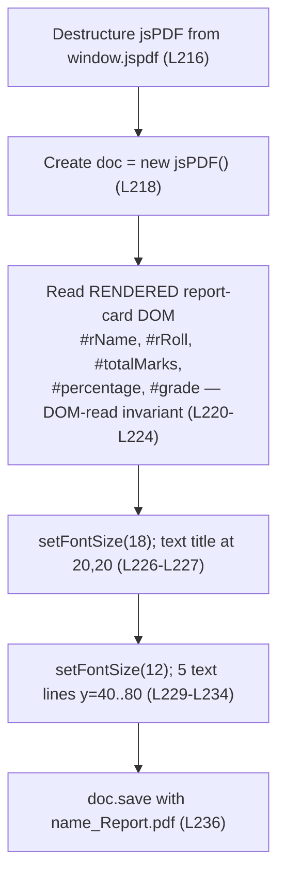

# PDF Export

## Purpose

This guide documents feature **F-007 PDF Export** (the Export layer): how the `downloadPDF()`
function exports the **rendered report card** as a PDF file using the jsPDF library. The function
reads its values from the **rendered DOM** — the populated report-card spans, **not** the form
inputs — and writes a fixed-layout, single-page document that the browser downloads
[Readme.md:L215-L237]. All content on this page is code-grounded in the application source embedded
in the repository-root `Readme.md`, and every technical claim carries an inline `[Readme.md:Lx-Ly]`
citation.

## Source Location

- **`downloadPDF()` implementation:** [Readme.md:L215-L237]
- **jsPDF CDN `<script>` tag** (the dependency this function relies on): [Readme.md:L38]

The exact `downloadPDF()` signature, the elements it reads and writes, and its error behavior are
documented in the [`../api-reference/script-js.md`](../api-reference/script-js.md) function
reference; the jsPDF CDN integration is documented in
[`../dependencies.md`](../dependencies.md).

---

## F-007 PDF Export

`downloadPDF()` is the function behind the **Download PDF** button [Readme.md:L56]. It takes no
parameters and returns `undefined`; its entire effect is to read the rendered report card and
trigger a browser file save [Readme.md:L215-L237]. It proceeds in five steps.

**1. Destructure the jsPDF constructor from the CDN global.** The capitalized `jsPDF` constructor
is pulled off the lowercase `window.jspdf` global that the cdnjs UMD bundle installs
[Readme.md:L216]:

```javascript
const { jsPDF } = window.jspdf;
```

Note the deliberate casing distinction: `window.jspdf` (all lowercase) is the global namespace, and
`jsPDF` (capitalized) is the constructor exposed on it [Readme.md:L216]. The
**jsPDF-present precondition** and the **CDN-availability** contract are owned by
[`../dependencies.md`](../dependencies.md).

**2. Instantiate the document.** A new PDF document is created [Readme.md:L218]:

```javascript
const doc = new jsPDF();
```

**3. Read the rendered report-card DOM (the DOM-read invariant).** `downloadPDF()` reads its five
values from the **rendered DOM** report-card spans — `#rName`, `#rRoll`, `#totalMarks`,
`#percentage`, and `#grade` — via `.innerText`, **not** from the form inputs
[Readme.md:L220-L224]:

```javascript
const name = document.getElementById('rName').innerText;
```

This is the **DOM-read invariant** — the single most architecturally significant expectation of the
application. Because the five values come from the **rendered** report card (the spans that
`generateReport()` populates) and not the form fields, **Generate Report must run before Download
PDF** [Readme.md:L220-L224]. The F-006 step that produces this rendered DOM is documented in
[`report-rendering.md`](report-rendering.md), and the full invariant is defined in
[`../contracts/behavioral-contracts.md`](../contracts/behavioral-contracts.md).

**4. Write the title and body lines.** The function sets the title font, writes the heading, then
sets the body font and writes five lines [Readme.md:L226-L234]. The exact positions and font sizes
are tabulated under [PDF Layout](#pdf-layout) below.

**5. Save the file.** The document is written to disk by the browser with a templated filename
[Readme.md:L236]:

```javascript
doc.save(`${name}_Report.pdf`);
```

---

## PDF Layout

`downloadPDF()` places one title line at font size `18` and five body lines at font size `12`, all
left-aligned at `x = 20`, stepping `y` from `40` to `80` in increments of `10`
[Readme.md:L226-L234]. The complete layout:

| Content | Font Size | x | y | Source |
| --- | --- | --- | --- | --- |
| `Student Report Card` (title) | 18 | 20 | 20 | [Readme.md:L226-L227] |
| `Student Name: <name>` | 12 | 20 | 40 | [Readme.md:L230] |
| `Roll Number: <roll>` | 12 | 20 | 50 | [Readme.md:L231] |
| `Total Marks: <total>` | 12 | 20 | 60 | [Readme.md:L232] |
| `Percentage: <percentage>%` | 12 | 20 | 70 | [Readme.md:L233] |
| `Grade: <grade>` | 12 | 20 | 80 | [Readme.md:L234] |

**Filename pattern.** The saved file is named `` `${name}_Report.pdf` `` [Readme.md:L236], where
`name` is the value read from the rendered `#rName` element [Readme.md:L220] — for example, a
rendered name of `Asha` produces `Asha_Report.pdf`.

**Note on the percentage `%`.** The trailing `%` in the PDF's percentage line comes from the
template literal `` `Percentage: ${percentage}%` `` [Readme.md:L233], where `percentage` is the
already-`.toFixed(2)` rendered string read from the `#percentage` span [Readme.md:L223]. This is
distinct from the static `%` that sits beside the on-screen percentage span in the HTML report card
[Readme.md:L76].

---

## downloadPDF() Flowchart

The deterministic sequence performed by `downloadPDF()` — destructure, instantiate, read the
rendered DOM, write the title and body, and save:



*Validated against the source `downloadPDF()` definition [Readme.md:L215-L237]; this flowchart
mirrors the authoritative diagram in [`../architecture/data-flow.md`](../architecture/data-flow.md).*

---

## Expected Behavior / Contract

This section states the **expectation from the code** for F-007 PDF Export. The complete,
authoritative catalog of invariants and preconditions is the
[`../contracts/behavioral-contracts.md`](../contracts/behavioral-contracts.md) single source of
truth; the CDN-availability contract is owned by [`../dependencies.md`](../dependencies.md). This
page documents the F-007-specific contract and links there rather than restating the full catalog.

| Aspect | Expectation | Source |
| --- | --- | --- |
| Precondition — ordering (DOM-read invariant) | `generateReport()` must have run first, because `downloadPDF()` reads the **rendered DOM** report card (`#rName`, `#rRoll`, `#totalMarks`, `#percentage`, `#grade`), not the form inputs. | [Readme.md:L220-L224] |
| Precondition — jsPDF present | `window.jspdf` must be populated by the cdnjs `<script>` before `downloadPDF()` destructures it; this requires internet access at page load. | [Readme.md:L38], [Readme.md:L216] |
| Inputs | The five **rendered** report-card values read via `.innerText`: `#rName`, `#rRoll`, `#totalMarks`, `#percentage`, `#grade`. | [Readme.md:L220-L224] |
| Output / postcondition | A single-page PDF named `<name>_Report.pdf` is generated and downloaded, laid out per the [PDF Layout](#pdf-layout) table. | [Readme.md:L236] |
| Error mode — missing jsPDF | If `window.jspdf` is `undefined`, the destructuring line throws a `TypeError`; there is **no programmatic handling**. | [Readme.md:L216], [Readme.md:L215-L237] |
| Error mode — download before generate | No error is thrown, but the resulting PDF contains blank/default values. | [Readme.md:L220-L224] |

The points below elaborate the contract:

- **Ordering precondition (DOM-read invariant).** Because `downloadPDF()` assembles the PDF from
  the *rendered* report card rather than the form fields [Readme.md:L220-L224], the user **must
  click Generate Report before Download PDF**. There is **no code guard** enforcing this order;
  it is a usage expectation. The full DOM-read invariant lives in
  [`../contracts/behavioral-contracts.md`](../contracts/behavioral-contracts.md).

- **jsPDF-present precondition / CDN-availability.** The first line destructures the global
  `window.jspdf` [Readme.md:L216], which is populated only after the cdnjs `<script>` loads
  successfully [Readme.md:L38] — i.e., internet access at page load. The CDN-availability contract
  is documented in [`../dependencies.md`](../dependencies.md).

- **Error mode — `TypeError`, surfaced only in the console.** If `window.jspdf` is `undefined`
  (the CDN is unreachable, blocked, or offline, or `downloadPDF()` somehow runs before the script
  has loaded), the line `const { jsPDF } = window.jspdf;` [Readme.md:L216] throws a `TypeError`
  ("cannot destructure property 'jsPDF' of 'undefined'"). The function contains **no `try`/`catch`
  and no programmatic error handling** anywhere [Readme.md:L215-L237], so the failure surfaces
  **only in the browser's developer console** — there is no on-screen message or fallback. This is
  the documented, expected behavior, not a bug to be patched in this documentation effort.

- **Error mode — silent blank PDF.** If **Download PDF** is clicked before **Generate Report**, no
  exception is raised: the rendered report card was never populated, so the DOM-read invariant
  reads empty strings [Readme.md:L220-L224] and the resulting PDF simply contains blank/default
  field values.

- **Version note.** The integration is pinned to **jsPDF 2.5.1** via the cdnjs URL
  [Readme.md:L38]; this documentation records that in-use version **as-is** and does not recommend
  an upgrade (out of scope). See [`../dependencies.md`](../dependencies.md).

---

## Related Documents

- [`../dependencies.md`](../dependencies.md) — jsPDF 2.5.1 CDN integration and the
  CDN-availability / jsPDF-present precondition.
- [`../contracts/behavioral-contracts.md`](../contracts/behavioral-contracts.md) — the DOM-read
  invariant and jsPDF precondition (single source of truth for invariants and preconditions).
- [`../api-reference/script-js.md`](../api-reference/script-js.md) — the exact `downloadPDF()`
  signature, its reads/writes, and error handling.
- [`../architecture/data-flow.md`](../architecture/data-flow.md) — the authoritative end-to-end
  data flow and function flowcharts.
- [`report-rendering.md`](report-rendering.md) — feature **F-006**, the on-screen rendering step
  that produces the rendered DOM this function reads.
- [`../index.md`](../index.md) — back to the Documentation Hub.
