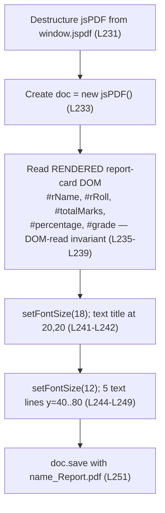

# PDF Export

> **Feature F-007 — Export layer.** This guide documents how the application exports the on-screen report card as a downloadable PDF.

## Purpose

This guide documents **F-007 PDF Export**: how the `downloadPDF()` function exports the rendered report card as a PDF file using the jsPDF library, reading its values from the **rendered DOM** rather than the form inputs [Readme.md:L230-L252]. It is fully **code-grounded** — every technical claim carries an inline `[Readme.md:Lx-Ly]` citation pointing at the application source embedded in the repository-root `Readme.md`, and every excerpt is a short verbatim quote. This is a documentation-only page; it does not modify any source code.

**Source:** `[Readme.md:L230-L252]` (the `downloadPDF()` function) and `[Readme.md:L53]` (the jsPDF CDN `<script>` tag).

---

## Source Location

- **`downloadPDF()`** — the export function, embedded in the `script.js` block [Readme.md:L230-L252].
- **jsPDF CDN `<script>` tag** — loads jsPDF **2.5.1** from cdnjs and publishes the `window.jspdf` global [Readme.md:L53].

The standalone `script.js` and `index.html` implied by the README's project tree do not physically exist; the entire application source is embedded inside `Readme.md`, which is therefore the sole source.

---

## F-007 PDF Export

`downloadPDF()` is the **Export layer**: it turns the already-rendered report card into a downloadable PDF. It is wired to the **Download PDF** button via an inline `onclick="downloadPDF()"` handler [Readme.md:L71], takes no parameters, and returns nothing — it runs purely for the side effect of saving a file. The function follows a fixed **destructure → instantiate → read → write → save** sequence.

**1. Destructure the jsPDF constructor from the CDN global.** The UMD build publishes a global namespace object named `window.jspdf` (all lowercase); the document constructor is a property of it called `jsPDF` (capital `P`, capital `DF`) [Readme.md:L231]:

```javascript
const { jsPDF } = window.jspdf;
```

**2. Instantiate a PDF document** [Readme.md:L233]:

```javascript
const doc = new jsPDF();
```

**3. Read the values from the RENDERED report card — the DOM-read invariant.** The function reads the five report-card spans (`#rName`, `#rRoll`, `#totalMarks`, `#percentage`, `#grade`) via `.innerText`, **not** the form inputs [Readme.md:L235-L239]:

```javascript
const name = document.getElementById('rName').innerText;
```

Because these are exactly the elements that `generateReport()` writes (see [`report-rendering.md`](report-rendering.md), **F-006**), the export mirrors whatever the rendered report card currently shows. This is the **DOM-read invariant**, and it is the single most architecturally significant expectation in the application: **Generate Report must run before Download PDF**, or the read values are empty/stale.

**4. Write the title and five body lines, then save.** The function sets two font sizes and writes a heading plus five report lines (detailed in the [PDF Layout](#pdf-layout) table below), then triggers the browser download [Readme.md:L251]:

```javascript
doc.save(`${name}_Report.pdf`);
```

For the exact function signature, the complete reads/writes tables, and the casing distinction between `window.jspdf` and `jsPDF`, see [`../api-reference/script-js.md`](../api-reference/script-js.md). For the jsPDF version, CDN URL, and the `window.jspdf` global contract, see [`../dependencies.md`](../dependencies.md).

---

## PDF Layout

`downloadPDF()` places text at fixed coordinates using jsPDF's `setFontSize(size)` and `text(string, x, y)` calls. The title is rendered at font size **18**; the five body lines at font size **12** [Readme.md:L241-L249]. The complete layout:

| Content | Font Size | x | y | Source |
| --- | --- | --- | --- | --- |
| `Student Report Card` (title) | 18 | 20 | 20 | [Readme.md:L241-L242] |
| `Student Name: <name>` | 12 | 20 | 40 | [Readme.md:L245] |
| `Roll Number: <roll>` | 12 | 20 | 50 | [Readme.md:L246] |
| `Total Marks: <total>` | 12 | 20 | 60 | [Readme.md:L247] |
| `Percentage: <percentage>%` | 12 | 20 | 70 | [Readme.md:L248] |
| `Grade: <grade>` | 12 | 20 | 80 | [Readme.md:L249] |

**Filename pattern.** The saved file is named `` `${name}_Report.pdf` `` [Readme.md:L251], where `name` is the value read from the rendered `#rName` element [Readme.md:L235] — for example, a report for a student named "Asha" downloads as `Asha_Report.pdf`.

> **The `%` in the Percentage line.** The trailing `%` in `Percentage: <percentage>%` comes from the template literal `` `Percentage: ${percentage}%` `` [Readme.md:L248], where `percentage` is the already-`.toFixed(2)` 2-decimal **string** read from the rendered `#percentage` span [Readme.md:L238]. Do not confuse it with the **static** `%` that the HTML report card renders immediately after its own `#percentage` span [Readme.md:L91]; they are two independent occurrences of the symbol.

---

## downloadPDF() Flowchart



*Validated against [Readme.md:L230-L252]; this flowchart mirrors the authoritative diagram in [`../architecture/data-flow.md`](../architecture/data-flow.md).*

---

## Expected Behavior / Contract

This block states **the expectation from the code** for the PDF export — the conditions it assumes, what it produces on success, and how it fails. The authoritative, full catalog of invariants and preconditions is the single source of truth in [`../contracts/behavioral-contracts.md`](../contracts/behavioral-contracts.md); the points below are summarized here (not duplicated) with citations.

| Aspect | Contract |
| --- | --- |
| **Precondition 1 — ordering / DOM-read invariant** | `generateReport()` MUST have run first. `downloadPDF()` reads the **rendered report-card spans** (`#rName`, `#rRoll`, `#totalMarks`, `#percentage`, `#grade`), **not** the form inputs [Readme.md:L235-L239]; if the report card was never rendered, the read values are empty/default. **Generate Report must run before Download PDF.** |
| **Precondition 2 — jsPDF present** | `window.jspdf` MUST be populated by the cdnjs `<script>` tag [Readme.md:L53] before `downloadPDF()` destructures it [Readme.md:L231]. This is the **jsPDF-present precondition**, and it requires **internet access at page load** (CDN-availability). |
| **Inputs** | The five rendered report-card values read via `.innerText`: `#rName`, `#rRoll`, `#totalMarks`, `#percentage`, `#grade` [Readme.md:L235-L239]. |
| **Output / Postcondition** | A PDF named `` `${name}_Report.pdf` `` is generated and downloaded [Readme.md:L251], laid out exactly per the [PDF Layout](#pdf-layout) table — title at font 18, five body lines at font 12. The exported **Total**, **Percentage**, and **Grade** values mirror the rendered report card, which derives from the fixed five-subject schema and `500`-point denominator owned by [`../reference/data-schema.md`](../reference/data-schema.md). |
| **Error mode — `TypeError`** | If `window.jspdf` is `undefined` (CDN unreachable, blocked, offline, or `downloadPDF()` run before the script loads), the line `const { jsPDF } = window.jspdf;` [Readme.md:L231] throws a **`TypeError`**. There is **no programmatic error handling** — **no `try`/`catch`** anywhere in the function [Readme.md:L230-L252] — so the failure surfaces **only in the browser console**; the page shows no on-screen error. |
| **Error mode — silent blank PDF** | "Download before Generate" throws **no** error, but because the rendered DOM was never populated, the saved PDF contains blank/default field values [Readme.md:L235-L239]. |

These are documented **expectations of the current code**, not defects to fix here; the jsPDF version is pinned at **2.5.1** [Readme.md:L53] and is documented as-is. For the CDN-availability contract see [`../dependencies.md`](../dependencies.md); for the canonical invariant and precondition definitions see [`../contracts/behavioral-contracts.md`](../contracts/behavioral-contracts.md).

---

## Related Documents

- [`../dependencies.md`](../dependencies.md) — jsPDF 2.5.1 CDN integration and the CDN-availability precondition (the `window.jspdf` global contract).
- [`../contracts/behavioral-contracts.md`](../contracts/behavioral-contracts.md) — the single source of truth for the DOM-read invariant and the jsPDF-present precondition.
- [`../reference/data-schema.md`](../reference/data-schema.md) — the single source of truth for the fixed values behind the exported figures: the five subjects, the `500`-point denominator, and the grade thresholds.
- [`../api-reference/script-js.md`](../api-reference/script-js.md) — the exact `downloadPDF()` signature, reads/writes, and error handling.
- [`../architecture/data-flow.md`](../architecture/data-flow.md) — the authoritative end-to-end data flow and the function flowcharts this page mirrors.
- [`report-rendering.md`](report-rendering.md) — **F-006**, the step that produces the rendered DOM that `downloadPDF()` reads.
- [`../index.md`](../index.md) — back to the Documentation Hub.

---

*Maintenance note: this guide is derived from the application source embedded in `Readme.md` [Readme.md:L230-L252]. If that embedded `downloadPDF()` code or the jsPDF CDN tag [Readme.md:L53] changes, update the cited line ranges, the PDF Layout table, and the flowchart here so this guide stays accurate.*
