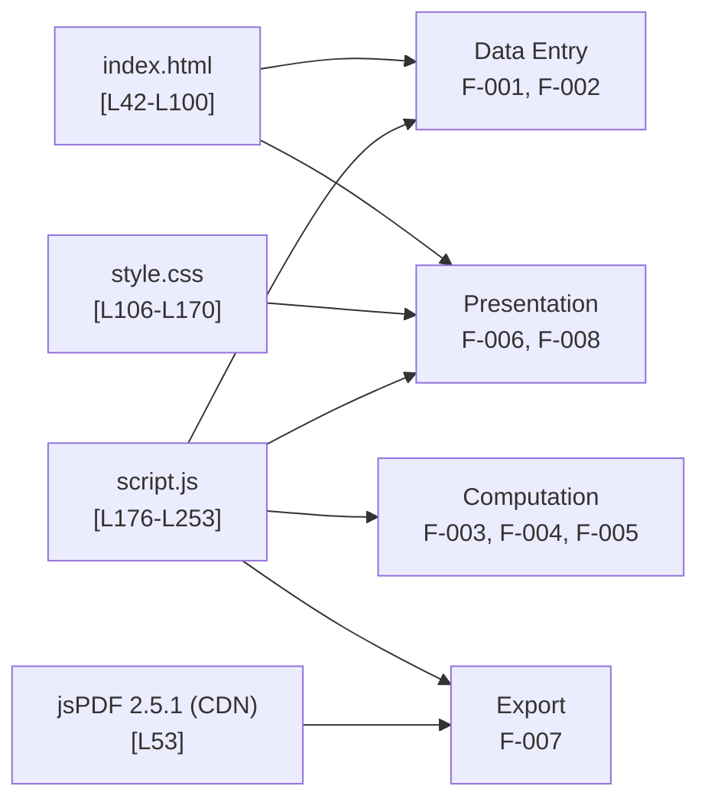

# Student Report Generator — Documentation Hub

## Purpose

Welcome to the documentation hub for the **Student Report Generator**. This page is the
single entry point to the project's **code-grounded** documentation and the **master table
of contents** for everything under the `docs/` tree.

All content across this documentation set is extracted directly from the application source,
which is embedded in the repository-root `Readme.md`. Every technical claim therefore carries
an inline citation pointing back to the exact source lines, so
the documentation stays traceable to — and verifiable against — the code.

The application itself is a **zero-install, browser-only static front-end**: it is built from
plain HTML, CSS, and vanilla JavaScript, with a single third-party library — **jsPDF**
[Readme.md:L270-L275] — loaded from a CDN [Readme.md:L53]. There is no backend, no database, no
build step, and nothing to install; the app runs entirely in the browser by opening `index.html`.

This hub is organized to satisfy two governing goals derived from the project requirement —
*"generate document based on the code, ensure the functionalities are clearly separated, and
highlight what is the expectation from the code"*:

- **Functional separation** — each distinct functional area is documented in its **own** file
  (never a single monolithic document). The functional decomposition is made visible below.
- **Expected behavior / contracts** — the explicit *expectation from the code* (invariants,
  preconditions, postconditions, error modes) is captured authoritatively in
  [`contracts/behavioral-contracts.md`](contracts/behavioral-contracts.md), and every functional
  and API document carries its own **Expected Behavior / Contract** block.

---

## How This Documentation Is Organized

The documentation follows an **organize-by-functionality** principle: rather than one large
document, each functional area of the application has a dedicated page. This makes the
**functional separation** explicit and lets a reader jump straight to the concern they care
about.

The application decomposes into **four functional layers** and **eight features**
(**F-001** through **F-008**). This is the canonical decomposition; the table below maps each
feature to the layer it belongs to and the primary document that covers it.

| Layer | Feature ID | Feature | Primary Doc |
|---|---|---|---|
| Data Entry | F-001 | Identity Capture (name, roll) | [functionality/data-entry.md](functionality/data-entry.md) — [Readme.md:L61-L62] [Readme.md:L177-L179] |
| Data Entry | F-002 | Marks Entry (5 subjects) | [functionality/data-entry.md](functionality/data-entry.md) — [Readme.md:L64-L68] [Readme.md:L181-L187] |
| Computation | F-003 | Total Aggregation | [functionality/computation.md](functionality/computation.md) — [Readme.md:L189-L205] |
| Computation | F-004 | Percentage | [functionality/computation.md](functionality/computation.md) — [Readme.md:L207] [Readme.md:L226] |
| Computation | F-005 | Grade Assignment | [functionality/grading.md](functionality/grading.md) — [Readme.md:L209-L221] |
| Presentation | F-006 | On-Screen Report Render | [functionality/report-rendering.md](functionality/report-rendering.md) — [Readme.md:L74-L93] [Readme.md:L191-L227] |
| Export | F-007 | PDF Export | [functionality/pdf-export.md](functionality/pdf-export.md) — [Readme.md:L230-L252] |
| Presentation | F-008 | Static Visual Styling | [functionality/styling.md](functionality/styling.md) — [Readme.md:L106-L170] |

The diagram below shows, at a glance, how the three embedded source components plus the jsPDF
dependency map onto the four functional layers. The detailed component and data-flow diagrams
live under [`architecture/`](architecture/component-model.md).

---

## Master Table of Contents

Every document in the `docs/` tree is listed below, grouped in a reader-friendly order. Each
link is relative to this `docs/` directory.

### 1. Getting Started

- [Getting Started](guides/getting-started.md) — zero-install run guide; prerequisites are a
  modern browser plus internet access for the CDN.
- [Usage Walkthrough](guides/usage.md) — step-by-step walkthrough, workflow ordering (Generate
  before Download), and troubleshooting.

### 2. Architecture

- [System Overview](architecture/overview.md) — system context, capability summary, success
  criteria, and the high-level architecture diagram.
- [Component Model](architecture/component-model.md) — the three logical components plus the
  jsPDF dependency and their relationships.
- [Data Flow](architecture/data-flow.md) — the DOM-mediated end-to-end flow, with flow diagrams
  for `generateReport()` and `downloadPDF()`.

### 3. Functionality (clearly separated, F-001..F-008)

Each functional area is documented on its own page, with an explicit **Expected Behavior /
Contract** block.

- [Data Entry](functionality/data-entry.md) — **F-001** Identity Capture + **F-002** Marks Entry
  from the **form inputs**.
- [Computation](functionality/computation.md) — **F-003** Total Aggregation + **F-004**
  Percentage `(total / 500) * 100`.
- [Grading](functionality/grading.md) — **F-005** Grade Assignment cascade and rubric.
- [Report Rendering](functionality/report-rendering.md) — **F-006** on-screen render into the
  **rendered DOM** (rebuild-from-scratch).
- [PDF Export](functionality/pdf-export.md) — **F-007** PDF export and the **DOM-read invariant**.
- [Styling](functionality/styling.md) — **F-008** static visual styling.

### 4. API Reference

- [script.js Reference](api-reference/script-js.md) — function reference and contracts for
  `generateReport()` and `downloadPDF()`.
- [HTML Structure Reference](api-reference/html-structure.md) — DOM element/ID reference and the
  button-to-function wiring.
- [CSS Reference](api-reference/css-reference.md) — selector and style reference.

### 5. Reference Data

- [Data Schema](reference/data-schema.md) — **single source of truth** for the fixed values:
  the five subjects, the per-subject maximum of `100`, the `500`-point total, and the six grade
  thresholds [Readme.md:L181-L221].

### 6. Behavioral Contracts

- [Behavioral Contracts](contracts/behavioral-contracts.md) — **single source of truth** for the
  invariants, preconditions, postconditions, and error modes; this is the consolidated answer to
  *"what is the expectation from the code?"*

### 7. Dependencies

- [Dependencies](dependencies.md) — the jsPDF **2.5.1** integration via cdnjs, the `window.jspdf`
  global contract, and the CDN-availability precondition [Readme.md:L53].

---

## Reading Guide & Navigation Model

**Hub-and-spoke navigation.** This page is the hub. The repository-root `Readme.md` links here
through its `## Documentation` section [Readme.md:L12-L23], and every document in the `docs/` tree
links **back to this hub** from its own *Related Documents* section. Start here, follow a spoke to
the topic you need, and use the back-link to return.

**Single source of truth (no duplication, no drift).** Two documents are authoritative and are
deliberately **not** restated elsewhere:

- [`reference/data-schema.md`](reference/data-schema.md) owns the **fixed values** — the five
  subjects, the per-subject maximum of `100`, the `500`-point denominator, and the six grade
  thresholds [Readme.md:L181-L221].
- [`contracts/behavioral-contracts.md`](contracts/behavioral-contracts.md) owns the
  **invariants and preconditions** — including the rebuild-from-scratch rendering, the no-NaN
  guard, the fixed two-decimal percentage precision, the default `'F'` grade, and the
  **DOM-read invariant** [Readme.md:L176-L253].

Other documents **link to** these two rather than copying their content, so there is exactly one
place to update if the underlying code changes.

**Suggested reading path for a new reader:**

1. [Getting Started](guides/getting-started.md) — get the app running, then read the
   [Usage Walkthrough](guides/usage.md).
2. [System Overview](architecture/overview.md) — understand the big picture and the components.
3. The [Functionality](functionality/data-entry.md) docs — read each feature in the order
   F-001 → F-008 to follow the data from entry through computation, rendering, and export.
4. [Behavioral Contracts](contracts/behavioral-contracts.md) and
   [Data Schema](reference/data-schema.md) — go here for depth on the exact expectations and
   fixed values, and to the [API Reference](api-reference/script-js.md) for precise signatures.

---

## Source & Citation Note

The project's `Readme.md` Project Structure tree lists `index.html`, `style.css`, and
`script.js` as standalone files [Readme.md:L29-L36]. In the current repository, however, these
source files exist **only as fenced code blocks embedded inside `Readme.md`**. All line-number
citations throughout this documentation therefore refer to `Readme.md`:

| Logical Source File | Embedded Location | Cite As |
|---|---|---|
| `index.html` (markup) | [Readme.md:L42-L100] | `[Readme.md:L42-L100]` |
| `style.css` (styles) | [Readme.md:L106-L170] | `[Readme.md:L106-L170]` |
| `script.js` (logic) | [Readme.md:L176-L253] | `[Readme.md:L176-L253]` |

This documentation is purely additive and does **not** modify any source code. If the embedded
code ever changes, the citations and any affected content must be updated to match.
