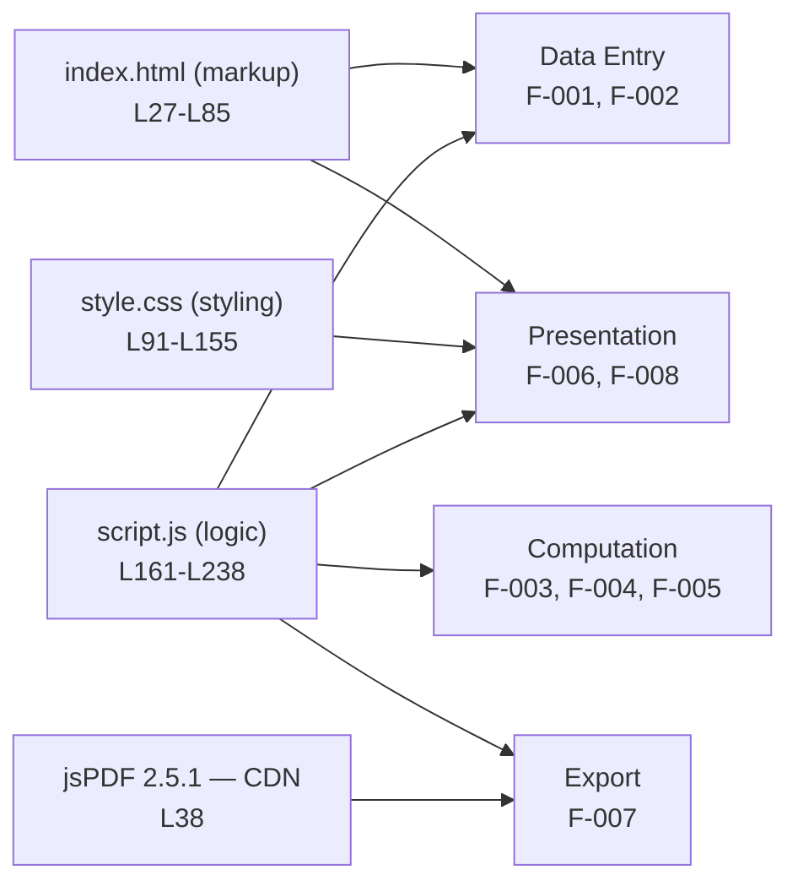

# Student Report Generator — Documentation Hub

Welcome to the documentation for the **Student Report Generator** — a zero-install, browser-only static front-end that captures student details, computes total/percentage/grade, renders an on-screen report card, and exports it as a PDF. This page is the **hub**: the single entry point that explains how the documentation is **organized by functionality** and provides the **master table of contents** linking every document in the `docs/` tree.

## Purpose

This hub is the entry point to **code-grounded documentation**: every page is extracted directly from the application source, and every technical claim carries an inline citation of the form `[Readme.md:Lx-Ly]`. The complete application — `index.html`, `style.css`, and `script.js` — is embedded as fenced code blocks inside the repository-root `Readme.md`, which is therefore the single source of truth for all content here.

The application itself is a **zero-install, browser-only static front-end** built with HTML, CSS, and vanilla JavaScript, using **jsPDF** (loaded from a CDN) for PDF export [Readme.md:L255-L260]. There is no backend, no build step, and no persistence: a reader opens `index.html` in a modern browser and the app runs immediately [Readme.md:L262-L268].

This documentation set was authored to satisfy two explicit goals:

- **Separate the functionalities clearly** — each functional area is documented in its own file, never a single monolithic document.
- **Highlight the expectation from the code** — every functional and API document includes an explicit **Expected Behavior / Contract** block, and all invariants are consolidated in [`contracts/behavioral-contracts.md`](contracts/behavioral-contracts.md).

---

## How This Documentation Is Organized

The organizing principle is **separation by functionality**: rather than one large file, the application is decomposed into **four functional layers** containing **eight discrete features (F-001 … F-008)**, and each feature is documented on its own page. The table below is the canonical decomposition; the **Primary Doc** column links to the page that owns each feature.

| Layer | Feature ID | Feature | Primary Doc |
|---|---|---|---|
| Data Entry | F-001 | Identity Capture (name, roll) | [`functionality/data-entry.md`](functionality/data-entry.md) [Readme.md:L46-L47, L162-L164] |
| Data Entry | F-002 | Marks Entry (5 subjects) | [`functionality/data-entry.md`](functionality/data-entry.md) [Readme.md:L49-L53, L166-L172] |
| Computation | F-003 | Total Aggregation | [`functionality/computation.md`](functionality/computation.md) [Readme.md:L174-L190] |
| Computation | F-004 | Percentage | [`functionality/computation.md`](functionality/computation.md) [Readme.md:L192, L211] |
| Computation | F-005 | Grade Assignment | [`functionality/grading.md`](functionality/grading.md) [Readme.md:L194-L206] |
| Presentation | F-006 | On-Screen Report Render | [`functionality/report-rendering.md`](functionality/report-rendering.md) [Readme.md:L59-L78, L176-L212] |
| Export | F-007 | PDF Export | [`functionality/pdf-export.md`](functionality/pdf-export.md) [Readme.md:L215-L237] |
| Presentation | F-008 | Static Visual Styling | [`functionality/styling.md`](functionality/styling.md) [Readme.md:L91-L155] |

The diagram below maps the three source components — `index.html` (markup), `style.css` (styling), and `script.js` (logic) — plus the **jsPDF** CDN dependency onto these functional layers. The detailed component and flow diagrams live under [`architecture/`](architecture/overview.md).

---

## Master Table of Contents

Every document in the `docs/` tree is listed below, grouped for reader-friendly navigation. All links are relative to this `docs/` directory.

### 1. Getting Started

- [`guides/getting-started.md`](guides/getting-started.md) — zero-install run guide; prerequisites (a modern browser and internet access for the jsPDF CDN).
- [`guides/usage.md`](guides/usage.md) — end-to-end walkthrough, the **Generate Report → Download PDF** workflow ordering, and troubleshooting.

### 2. Architecture

- [`architecture/overview.md`](architecture/overview.md) — system context, capabilities, success criteria, and the high-level architecture diagram.
- [`architecture/component-model.md`](architecture/component-model.md) — the three logical components (markup, styling, logic) plus the jsPDF dependency and their responsibilities.
- [`architecture/data-flow.md`](architecture/data-flow.md) — the DOM-mediated end-to-end data flow, with flowcharts for `generateReport()` and `downloadPDF()`.

### 3. Functionality (clearly separated, F-001 … F-008)

- [`functionality/data-entry.md`](functionality/data-entry.md) — **F-001 Identity Capture** + **F-002 Marks Entry**: reading the **form inputs**, with the `parseInt(value) || 0` no-NaN guard [Readme.md:L162-L172].
- [`functionality/computation.md`](functionality/computation.md) — **F-003 Total Aggregation** + **F-004 Percentage**: the running total and `(total / 500) * 100` rendered with `.toFixed(2)` [Readme.md:L192, L211].
- [`functionality/grading.md`](functionality/grading.md) — **F-005 Grade Assignment**: the threshold cascade with a default of `'F'`, plus a grade-decision flowchart [Readme.md:L194-L206].
- [`functionality/report-rendering.md`](functionality/report-rendering.md) — **F-006 On-Screen Report Render**: the **rebuild-from-scratch** marks-table invariant and the DOM writes back to the report card [Readme.md:L176-L212].
- [`functionality/pdf-export.md`](functionality/pdf-export.md) — **F-007 PDF Export**: the **DOM-read invariant** (reads the rendered report, not the form inputs) and the `${name}_Report.pdf` filename [Readme.md:L215-L237].
- [`functionality/styling.md`](functionality/styling.md) — **F-008 Static Visual Styling**: layout, color palette, and table styling; viewport-only responsiveness (no `@media` rules) [Readme.md:L91-L155].

### 4. API Reference

- [`api-reference/script-js.md`](api-reference/script-js.md) — function reference for `generateReport()` and `downloadPDF()`: parameters, returns, DOM reads/writes, side effects, and errors [Readme.md:L161-L238].
- [`api-reference/html-structure.md`](api-reference/html-structure.md) — the DOM element/ID reference table and how the buttons are wired to the functions [Readme.md:L27-L85].
- [`api-reference/css-reference.md`](api-reference/css-reference.md) — the selector/style reference for `style.css` [Readme.md:L91-L155].

### 5. Reference Data

- [`reference/data-schema.md`](reference/data-schema.md) — **single source of truth** for fixed values: the five subjects, the per-subject maximum of `100`, the `500`-point total, and the six grade thresholds [Readme.md:L166-L206].

### 6. Behavioral Contracts

- [`contracts/behavioral-contracts.md`](contracts/behavioral-contracts.md) — **single source of truth** for invariants, preconditions, and postconditions — i.e., **the expectation from the code** (rebuild-from-scratch, the no-NaN guard, `.toFixed(2)` precision, the default `'F'` grade, and the DOM-read invariant) [Readme.md:L161-L238].

### 7. Dependencies

- [`dependencies.md`](dependencies.md) — the jsPDF **2.5.1** integration via cdnjs, the `window.jspdf` global contract, and the CDN-availability precondition [Readme.md:L38].

---

## Reading Guide & Navigation Model

**Hub-and-spoke navigation.** This page (`docs/index.md`) is the hub and entry point. The repository-root `Readme.md` links here through its **Documentation** section, and every document in the tree links **back to this hub**. From any page you are at most one click from the master table of contents above.

**Single source of truth.** To prevent drift, two documents are authoritative and are never duplicated elsewhere:

- [`reference/data-schema.md`](reference/data-schema.md) owns the **fixed values** (subjects, the per-subject maximum, the `500` denominator, and the grade thresholds).
- [`contracts/behavioral-contracts.md`](contracts/behavioral-contracts.md) owns the **invariants and preconditions** (the expectation from the code).

Every other document **links to** these two rather than restating them, so any change is made in exactly one place.

**Suggested reading path for a new reader:**

1. [`guides/getting-started.md`](guides/getting-started.md) — get the app running in your browser.
2. [`architecture/overview.md`](architecture/overview.md) — understand the system at a glance.
3. The [`functionality/`](functionality/data-entry.md) documents (F-001 … F-008) — learn each feature in isolation.
4. [`contracts/behavioral-contracts.md`](contracts/behavioral-contracts.md) and [`reference/data-schema.md`](reference/data-schema.md) — go deep on the exact expectations and fixed values.

---

## Source Files & Citations

The project's three source files are advertised as standalone files in the README project tree [Readme.md:L14-L21], but they currently exist **only embedded** as fenced code blocks inside the repository-root `Readme.md`. Consequently, **all line-range citations throughout this documentation refer to `Readme.md`**:

| Source component | Embedded location |
|---|---|
| Markup — `index.html` | [Readme.md:L27-L85] |
| Styles — `style.css` | [Readme.md:L91-L155] |
| Logic — `script.js` | [Readme.md:L161-L238] |

Citations use the inline form `[Readme.md:Lx-Ly]`, and code excerpts are kept short and verbatim, matching the conventions of the root `Readme.md` [Readme.md:L1-L21].

---

*Maintenance note: this hub is derived from the application source embedded in `Readme.md` [Readme.md:L1-L281]. If documents are added to or removed from the `docs/` tree, or if the embedded code changes, update this master table of contents and the cited line ranges so the documentation stays accurate.*
